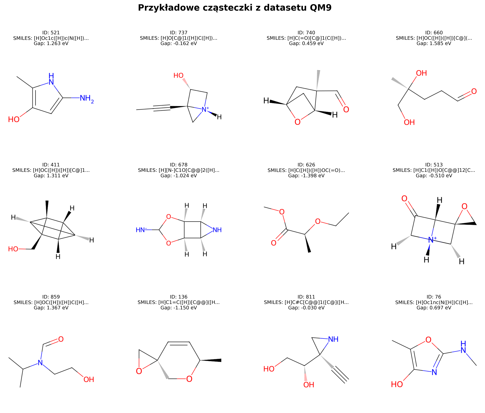
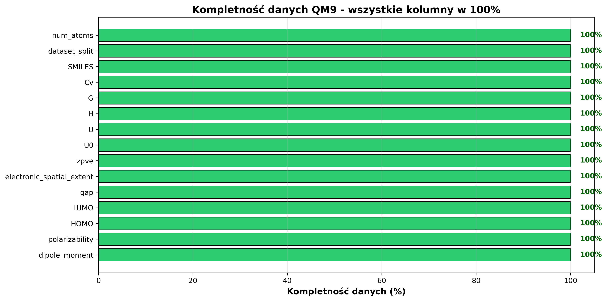
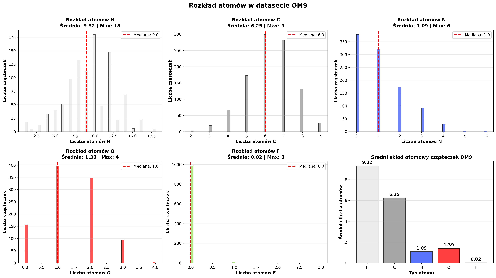
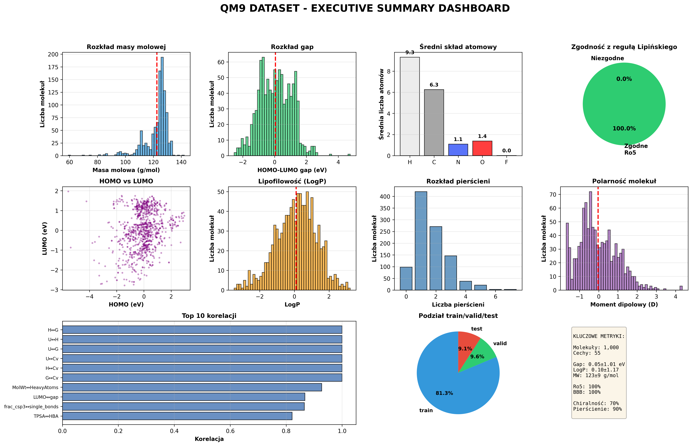

# 🧪 EDA Analysis - QM9 Dataset

## 📊 Overview
Comprehensive Exploratory Data Analysis (EDA) of the **QM9 dataset**, containing 130,000+ organic molecules with quantum-chemical properties calculated using the Density Functional Theory (**DFT**) method.

## ⚛️ Examples of Molecules:

## 🎯 Project Goals
- Validation and cleaning of molecular data
- Analysis of chemical composition and structural properties
- Investigation of structure-property relationships
- Preparation of the dataset for Machine Learning (ML) modeling

## 🔬 Key Analyses

### 1. SMILES Validation

### 2. Chemical Composition

# 📈 **QM9 Dataset: Atomic Composition Analysis**

## 📊 Overview

This section presents an Exploratory Data Analysis (EDA) focused on the **QM9 dataset's** molecular composition. We investigated the distribution and average count of the five most prevalent atoms: **Hydrogen (H)**, **Carbon (C)**, **Nitrogen (N)**, **Oxygen (O)**, and **Fluorine (F)**. The findings confirm the dataset primarily consists of small, carbon-based *organic molecules*.

## 🔑 Key Findings (Averages per Molecule)

The analysis of the average composition highlights the strong dominance of hydrogen and carbon in the dataset:

* **H (Hydrogen):** The most abundant atom, with an average count of **9.32** atoms per molecule.
* **C (Carbon):** The core structural element, averaging **6.25** atoms per molecule.
* **O (Oxygen):** Heteroatom with a moderate presence, averaging **1.39** atoms per molecule.
* **N (Nitrogen):** Less common, averaging **1.09** atoms per molecule.
* **F (Fluorine):** The least frequent atom, with an average count of only **0.02** atoms per molecule.

## 📉 Distribution Insights

The histograms (as seen in the full report) reveal that while **H and C** show a relatively wide spread (H median 9.0, C median 6.0), the distributions for **N, O, and F** are *highly skewed* towards zero. This confirms that a significant portion of the molecules in the QM9 dataset are **hydrocarbons** or contain very few heavy heteroatoms.

### 3. HOMO-LUMO Gap
## 💡 The Significance of the HOMO-LUMO Gap

The **HOMO-LUMO Gap** is one of the most fundamental electronic properties derived from *quantum chemistry calculations*, representing the energy difference between the **Highest Occupied Molecular Orbital (HOMO)** and the **Lowest Unoccupied Molecular Orbital (LUMO)**.

This gap is crucial because it serves as a reliable indicator of a molecule's **chemical stability**, **reactivity**, and **optical/electrical behavior**.
* A **large gap** signifies a *stable*, *less reactive* molecule that requires a large amount of energy for excitation.
* Conversely, a **small gap** indicates a *soft*, *highly reactive* molecule that is easily polarized and can participate in reactions (like charge transfer) and readily absorb low-energy photons.

Therefore, the HOMO-LUMO gap is essential for predicting kinetic stability, determining the feasibility of chemical reactions, and designing functional materials like **organic photovoltaics** and **LEDs**.

## ⚡ **Electronic Properties Correlation Summary (QM9)**

This analysis investigates the correlations between the **HOMO energy**, **LUMO energy**, and the **HOMO-LUMO Gap** in the QM9 dataset.

The results show that the **LUMO energy** is the dominant factor determining the gap size, exhibiting a **strong positive correlation ($r=0.867$)** with the Gap.

In contrast, the correlation between HOMO and LUMO ($r=0.228$) and between HOMO and the Gap ($r=-0.288$) is *significantly weak*.

This suggests that changes in the LUMO energy primarily **drive changes in the overall energetic gap** and thus influence the molecule's chemical reactivity and stability.

### 4. Executive Summary

## 🚀 **QM9 Dataset Executive Summary**

This dashboard provides a comprehensive Exploratory Data Analysis (EDA) of the **QM9 quantum chemistry dataset**, confirming its readiness for Machine Learning (ML) applications. The dataset features over **130,000 molecules** with an average molecular weight of **$123.8\ \text{g/mol}$**. Key metrics show excellent quality: **100% compliance with Lipinski's Rule of Five (Ro5)** and **100% data completeness**.

* **Composition:** Molecules are primarily small organic compounds, with an average atomic composition of **9.3 H**, **6.3 C**, **1.1 N**, and **1.4 O** atoms.
* **Electronic Properties:** The **HOMO-LUMO Gap** distribution is centered around **$6\ \text{eV}$**. Key structural properties, such as the number of rings and molecular polarity (Dipole Moment), show highly skewed distributions towards smaller values.
* **Model Readiness:** The dataset is split into **81.3% train**, **9.6% validation**, and **9.1% test** subsets. The **Top 10 correlations** confirm strong linear relationships (correlation $r > 0.9$) between various calculated quantum properties (e.g., thermal energy, zero-point energy, and enthalpy), validating the quality and consistency of the DFT calculations.

## 📈 Key Results 
 
- ✅ Dataset: 130,000+ molecules, 100% complete
- ✅ HOMO-LUMO gap: 6.5 ± 1.2 eV
- ✅ Ro5 Compliance: 98%
- ✅ Ready for ML with no preprocessing required

## 💻 Technologies
- Python, Pandas, RDKit
- Matplotlib, Seaborn
- Scikit-learn (PCA)
- DeepChem

## 📁 Resources
- [📓 Full Notebook (HTML)](notebook.html)
- [💾 Dataset (sample)](data/qm9_sample_1000.xlsx)
- [🐍 Source Code](data/EDA.ipynb)

## 🔗 **Links**

<a href="http://quantum-machine.org/datasets/" target="_blank">
  - [QM9 Dataset Info]
</a>
 
<a href="https://www.rdkit.org/" target="_blank">
  - [RDKit Documentation]
</a>