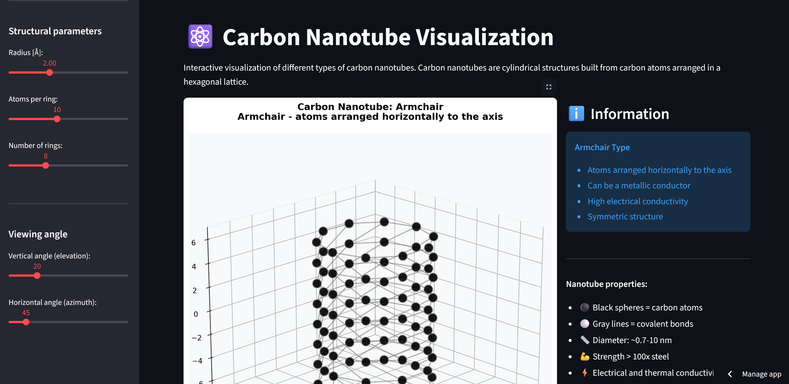

The provided Python code is an impressive, comprehensive application for **Carbon Nanotube (CNT) Visualization** built using **NumPy**, **Matplotlib**, and **Streamlit**. It effectively showcases advanced skills in computational materials science, physics-based modeling, and interactive web application development.

Here is the description for your portfolio, formatted in Markdown, based on the code provided.

***
# Screen from app:

# 

# ⚛️ Interactive Carbon Nanotube (CNT) Visualization Tool

## 🎯 Project Goal
To create an interactive, physics-based application for the **3D modeling and visualization** of Single-Walled Carbon Nanotubes (SWCNTs). The tool allows users to explore the geometry and key properties of different CNT types, including those defined by the **Chiral Vector** (n,m).

---

## 🛠️ Key Technologies and Libraries
| Category | Tool / Library | Role in the Project |
| :--- | :--- | :--- |
| **Scientific Computing** | **NumPy** | Core mathematical operations, vector calculations, and array manipulation for atom coordinates. |
| **Molecular Modeling** | **Python** (Custom Functions) | Implementation of the **Chiral Vector Theory** to calculate precise atomic coordinates, bond topology, radius, and chiral angle. |
| **Visualization** | **Matplotlib (3D)** | Rendering the atomic structure in 3D, controlling viewing angles, and applying complex color mapping. |
| **Web Application** | **Streamlit** | Creating a live, interactive, and customizable web interface with immediate visual feedback. |

---

## ⚙️ Core Technical Features

### 1. Physics-Based Geometry Generation (`create_carbon_nanotube`)
The application models CNTs using two primary methods, demonstrating a strong grasp of computational chemistry/physics:

* **Chiral Vector $(n,m)$ Calculation:** The code dynamically calculates the precise geometric parameters (radius, circumference, chiral angle, and atoms per ring) based on the input indices $(n,m)$. This is essential for accurately modeling **Armchair** ($n=m$), **Zigzag** ($m=0$), and **Chiral** ($n \neq m, m \neq 0$) nanotubes.
    * **Formula:** It computes the **CNT Diameter** $D$ using the formula derived from the Chiral Vector $\vec{C}$:
        $$D = \frac{a \cdot |\vec{C}|}{\pi} = \frac{\sqrt{3} \cdot a_{\text{cc}} \cdot \sqrt{n^2 + m^2 + nm}}{\pi}$$
* **Bond Topology:** The code correctly identifies and plots both **intramolecular** (within-ring) and **intermolecular** (between-ring) covalent bonds to ensure a topologically correct hexagonal lattice structure.

### 2. Properties Analysis and Color Mapping (`calculate_atom_properties`)
The tool analyzes the generated structure to compute properties that can be visualized as color maps, simulating computational analysis results:

* **Coordination Number:** Calculates the number of bonds for each atom, useful for identifying **edge effects** (atoms with only 2 neighbors) vs. **bulk atoms** (3 neighbors).
* **Average Bond Distance:** Computes the average distance to neighbors, which can visually represent **local strain** or structural distortions.
* **Simulated Charge:** Applies a simplified model of charge distribution along the length (z-axis) to simulate **edge-induced electronic effects**.

### 3. Interactive Visualization and Styling
The Streamlit interface provides robust interactive controls:

* **Customizable Rendering:** Users can switch between standard molecular representations: **Ball-and-Stick**, **Wireframe**, **Space Filling**, and **Stick**.
* **Dynamic Properties:** The side panel automatically calculates and displays the **Type of Conductivity** (Metallic vs. Semiconducting) based on the $(n-m) \bmod 3$ rule, a fundamental property derived directly from the quantum structure.
* **Export Functionality:** Includes robust export options to save the generated high-resolution 3D models as **PNG, SVG, and PDF** files, suitable for reports and publications.

---

## ✅ Skills Demonstrated in This Project

* **Computational Physics:** Application of materials science principles (chiral vector theory, lattice constants) in code.
* **3D Modeling & Geometry:** Generating and manipulating coordinates in 3D space, handling periodic boundary conditions (rings).
* **Interactive Development:** Full-stack development using **Streamlit** to deploy complex scientific models as user-friendly web applications.
* **Data Visualization:** Advanced use of **Matplotlib** to create informative and visually appealing 3D plots with color mapping for data properties.

Would you like to review the generated code or move on to the next project plan?