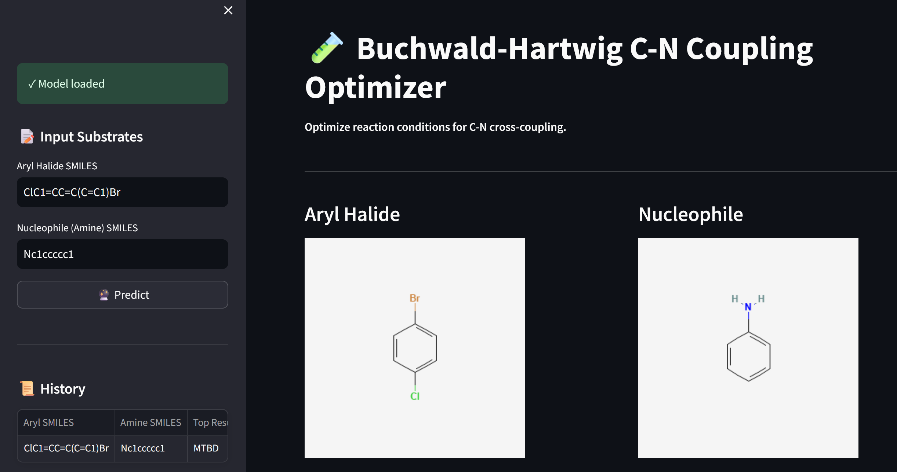
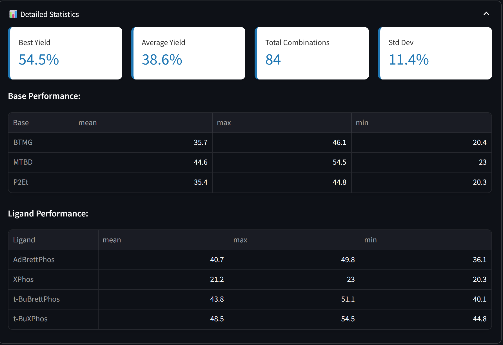

# Buchwald-Hartwig C-N Coupling Optimizer

📈 Some Some screenshots from application: 





## Overview

An **interactive ML-powered web application** that predicts optimal reaction conditions for Buchwald-Hartwig C-N cross-coupling reactions. Users input substrate SMILES strings and receive AI-generated recommendations for base, ligand, and additive combinations.

- **🚀 Live Demo** - <a href="https://buchwald-hartwig-optimizer.streamlit.app/" target="_blank">View Live App</a>
- **📂 GitHub Repository** - <a href="https://github.com/slastrzelec/06_reaction_opt" target="_blank">View on GitHub</a>

## Tech Stack

- **Backend:** Python, Scikit-learn (Random Forest), RDKit
- **Frontend:** Streamlit
- **Data Processing:** Pandas, NumPy
- **Deployment:** Streamlit Cloud
- **Version Control:** Git/GitHub

## Key Features

✅ **Real-time Predictions** - Get top 10 reaction condition recommendations instantly  
✅ **Molecular Visualization** - Auto-generate structure diagrams from SMILES (PubChem API)  
✅ **Detailed Analytics** - Statistical breakdown of base/ligand performance  
✅ **Export Options** - Download results as CSV or PDF reports with structures  
✅ **Prediction History** - Track all past predictions in sidebar  
✅ **Interactive UI** - Clean, responsive design with intuitive controls

## Project Architecture
```
data/
├── doyle_buchwald_data_cleaned.csv      # 4,312 training samples
├── X_features_scaled.csv                # Scaled feature matrix
├── trained_models/
│   └── best_model.pkl                   # Random Forest model (R² = 0.30)
│
src/
├── feature_engineering.py               # RDKit descriptor extraction
├── model_training.py                    # ML model training & evaluation
└── prediction.py                        # Inference pipeline

app.py                                   # Streamlit application
```

## How It Works

1. **Input:** User provides SMILES for aryl halide and nucleophile
2. **Validation:** SMILES syntax checking via RDKit
3. **Feature Generation:** Categorical features (3 bases × 4 ligands × 24 additives)
4. **Prediction:** Random Forest model predicts yield for all 288 combinations
5. **Output:** Top 10 recommendations sorted by predicted yield
6. **Export:** Results downloadable as CSV or PDF with molecular structures

## Model Performance

- **Algorithm:** Random Forest Regressor
- **Training Samples:** 4,312 reactions
- **Features:** 71 (after feature engineering)
- **Current R²:** 0.30 (early prototype)
- **Target R²:** 0.65+ (in development)

## Data Source

Dataset: Buchwald-Hartwig C-N Coupling Reactions (Ahneman et al.)
- 4,312 high-throughput experimental reactions
- Conditions: 3 bases, 4 ligands, 24 additives
- Target: Reaction yield (0-100%)

## Development & Roadmap

**✅ Completed:**
- Data cleaning & preprocessing (287 incomplete rows removed)
- Feature engineering (RDKit descriptors + one-hot encoding)
- Model training (Random Forest + Gradient Boosting comparison)
- Streamlit application with core functionality
- PDF/CSV export with molecular visualizations
- Prediction history tracking

**🔄 In Progress:**
- Model optimization (improving R² from 0.30 to 0.65+)
- Advanced molecular fingerprinting (Morgan fingerprints, MACCS keys)
- UI/UX enhancements (dark mode, custom styling)

**📋 Planned:**
- Reaction mechanism insights
- Integration with experimental validation data
- Real-time model performance metrics dashboard
- Mobile app version

## Learning Outcomes

This project demonstrates:

- **Data Science:** Data cleaning, feature engineering, ML model training & evaluation
- **Python:** Pandas, NumPy, Scikit-learn, RDKit, Streamlit
- **Web Development:** Interactive UI design, API integration (PubChem)
- **Deployment:** Streamlit Cloud, Git/GitHub workflows
- **Chemistry:** Buchwald-Hartwig reactions, SMILES notation, molecular descriptors
- **Research:** Systematic approach to model development & optimization

## Usage
```bash
# Clone repository
git clone https://github.com/slastrzelec/06_reaction_opt.git
cd 06_reaction_opt

# Install dependencies
pip install -r requirements.txt

# Run application locally
streamlit run app.py

# Open http://localhost:8501
```

## Disclaimer

⚠️ **Development Version Notice**

This is an early-stage prototype actively being improved. Model predictions should always be validated experimentally. Current accuracy (R² = 0.30) is suitable for initial optimization only. Final version will target R² > 0.65 with production-grade UI/UX.

---

**Status:** Active Development | **Last Updated:** December 2025