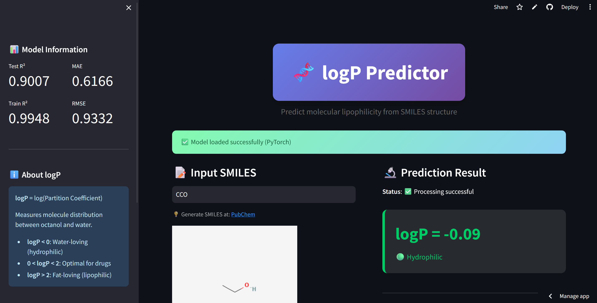
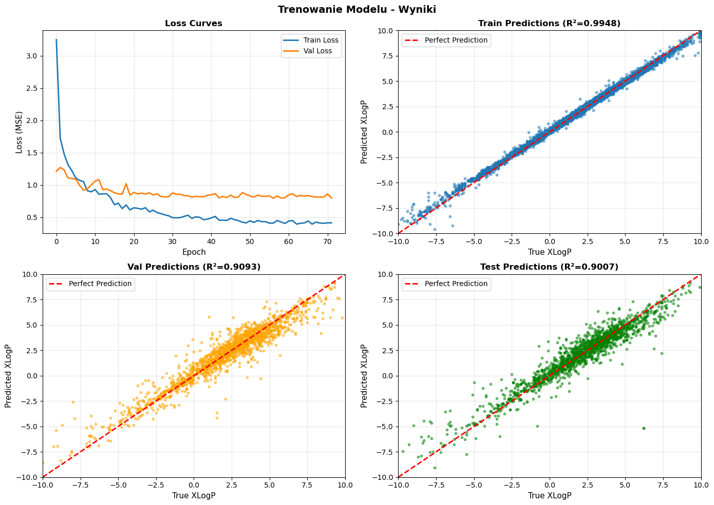

# 🧬 Molecular logP Predictor | Deep Learning & Chemoinformatics

### 🌟 Project Overview
**A sophisticated Deep Learning tool designed to bridge the gap between chemical structure and biological property prediction.** This application leverages a 4-layer Neural Network (~1.2M parameters) to estimate the **n-octanol/water partition coefficient (logP)** directly from SMILES notation. 

By combining **2048-bit Morgan Fingerprints** with physical descriptors, the model provides critical insights into a molecule's hydrophobicity, essential for drug discovery and virtual screening.

### 🛠️ Tech Stack
* **Deep Learning:** PyTorch (Multilayer Perceptron with BatchNorm & Dropout)
* **Chemoinformatics:** RDKit (SMILES processing, Molecular Visualization)
* **Data Science:** Scikit-learn, Pandas, NumPy
* **Deployment:** Streamlit (Web Interface)

### 🚀 Key Capabilities
* **Advanced Featurization:** Hybrid approach using fingerprints and 6 key descriptors (MolWt, TPSA, etc.).
* **Real-time Prediction:** Instant logP calculation with categorical interpretation (e.g., "Optimal for drugs").
* **Dynamic Visualization:** On-the-fly 2D molecular structure rendering for immediate verification.
* **Transparent AI:** Integrated visualization of the training process to monitor convergence and prevent overfitting.

### 📈 Model Performance & Metrics Analysis
The model underwent rigorous training on over 11,000 molecules to ensure reliability across diverse chemical spaces.

* **Loss Convergence:** Smooth decrease in Mean Squared Error (MSE), with validation loss stabilizing at a low level, confirming robust learning.
* **High Precision Benchmarks:**
    * **Training R²:** 0.9948
    * **Validation R²:** 0.9093
    * **Test R²:** 0.9007 (Consistent performance on unseen molecules)
* **Error Metrics:** Achieved a **Mean Absolute Error (MAE) of 0.61**, ensuring high accuracy for pharmacological assessment.
* **Regularization:** The train/test R² gap (0.99 vs 0.90) is the expected signature of a ~1.2M-parameter model on ~11,600 molecules — controlled with dropout, batch normalization and early stopping (training halted at epoch 72/100, before the gap widened further) rather than chased away with more model capacity.

#### **Visualizing Accuracy**
The parity plots demonstrate that predictions align closely with the "Perfect Prediction" line across a wide range of logP values (from -10 to +10).

**Skills Demonstrated:**
- ✅ Deep learning (PyTorch, MLP architecture, regularization, early stopping)
- ✅ Cheminformatics (SMILES, Morgan fingerprints, molecular descriptors)
- ✅ Honest evaluation (train/val/test gap reported and explained, not hidden)

**Related project:** [Drug Solubility Predictor](../drug-solubility-prediction/index.md) — same task family (single-molecule physicochemical property prediction from SMILES via RDKit descriptors/fingerprints), different target property and model (Random Forest) and features (Morgan fingerprints).

### 🔗 Links
<a href="https://molecular-lipophilicity-ai.streamlit.app/" target="_blank">Live Demo on Streamlit</a> | <a href="https://github.com/slastrzelec/molecular-lipophilicity-ai" target="_blank">Source Code</a>