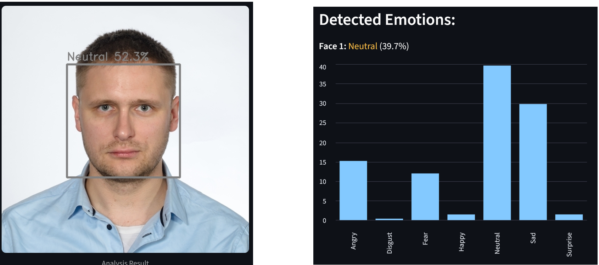

# 😊 Emotion Recognition System  
**Facial Emotion Detection with OpenCV, PyTorch & Streamlit**

---

## 📌 Project Overview

**Emotion Recognition System** is a deep learning–based web application for automatic facial emotion recognition from images.  
The project demonstrates a complete **Computer Vision pipeline**, covering face detection, CNN-based emotion classification, and interactive result visualization in a web interface.

It was designed as an **end-to-end portfolio project**, showcasing both machine learning expertise and practical model deployment.

---

## 🎯 Features

- 📤 Image upload (JPG / PNG)
- 📸 Test image loaded directly from GitHub
- 👁️ Multiple face detection in a single image
- 🧠 Emotion classification using a CNN
- 📊 Visualization of:
  - face bounding boxes
  - predicted emotion labels
  - confidence scores
  - full probability distribution across classes
- ⚡ Fast inference (~50 ms per face)

---

## 🧠 Machine Learning Model

- **Type**: Convolutional Neural Network (CNN)
- **Framework**: PyTorch
- **Dataset**: FER-2013
- **Number of classes**: 7  
  - Angry  
  - Disgust  
  - Fear  
  - Happy  
  - Neutral  
  - Sad  
  - Surprise  

### Architecture (summary)
- 4 convolutional blocks: Conv2D → BatchNorm → ReLU → MaxPool → Dropout  
- Fully connected classifier  
- ~11M trainable parameters  

**Test accuracy:** 59.64%

---

## 👁️ Face Detection

- **Technology**: OpenCV  
- **Algorithm**: Haar Cascade Classifier  

The system detects multiple faces per image and performs emotion inference independently for each detected face.

---

## 🖥️ Web Application

- **Framework**: Streamlit
- **Key aspects**:
  - cached model and resources for performance
  - session state management
  - clean and user-friendly UI (sidebar + columns)
  - ready for demo and deployment

---

## 🧰 Tech Stack

- **Python**
- **PyTorch** – deep learning
- **OpenCV** – computer vision
- **Streamlit** – web deployment
- **NumPy / PIL**
- **Git & GitHub**

---

## 🚀 Use Cases

- Human–Computer Interaction (HCI)
- User behavior analysis
- Emotion-aware feedback systems
- Computer Vision R&D projects
- Machine Learning demos for technical interviews

---

## 📂 Repository

🔗 GitHub:  
https://github.com/slastrzelec/12_emotion-detection-app

---

## 👨‍💻 Author

**Sławomir Strzelec**  
Data Scientist | Machine Learning Practitioner  

- 📍 Kraków, Poland  
- 💼 LinkedIn: https://www.linkedin.com/in/sławomir-strzelec  
- 💻 GitHub: https://github.com/slastrzelec  

---

## 📌 Project Status

✅ Completed  

🔧 Potential extensions:
- Grad-CAM / model explainability  
- video & webcam support  
- Dockerized cloud deployment  
- higher-performing architectures (ResNet, EfficientNet)
