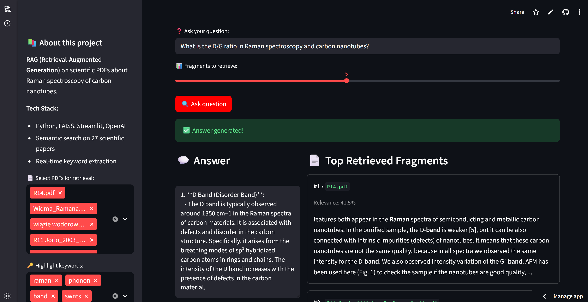

# 💡 Carbon Nanotubes RAG System

**Production-grade Retrieval-Augmented Generation system — from a Streamlit prototype to a tested, containerized, deployed REST API**

## 🎯 Overview

A full RAG system for semantic search and Q&A over 25 scientific papers on Raman spectroscopy of carbon nanotubes. What started as a simple Streamlit demo was rebuilt in six deliberate phases into a system with correct retrieval math, hybrid search, a validated REST API, structured logging, Docker containers, automated CI testing, and a live public deployment.



## 🚀 What This Project Demonstrates

This isn't just a working demo — it's built and documented the way a production system would be:

- **Correct retrieval math** — `IndexFlatIP` with L2-normalized embeddings for true cosine similarity, hybrid dense + BM25 search, sentence-aware chunking, content-hash deduplication of source documents
- **Measured quality** — evaluated with [RAGAs](https://github.com/explodinggradients/ragas) (faithfulness ≈ 0.80–0.82 across 14 domain questions, including a deliberate out-of-scope question as a hallucination check)
- **A real REST API** (FastAPI), not just a UI — request validation, proper HTTP error handling, auto-generated interactive docs, and its own test suite
- **21 automated tests**, running on every push via GitHub Actions (green build badge on the repo)
- **Structured JSON logging** — every request logged with method, path, status, and duration
- **Dockerized** — separate containers for the API and the UI, orchestrated with docker-compose, optimized to fit a 512MB free-tier deployment
- **Live deployment** — the API runs publicly on Render, not just on localhost

## 🛠️ Tech Stack

- **Retrieval**: FAISS (`IndexFlatIP`, cosine similarity), Sentence Transformers, BM25 (hybrid search)
- **Generation**: OpenAI API (`gpt-4o-mini`)
- **API**: FastAPI, Pydantic validation
- **UI**: Streamlit
- **Testing**: pytest (21 tests), RAGAs (answer quality evaluation)
- **Infra**: Docker, docker-compose, GitHub Actions (CI), Render (deployment)

## 📊 How It Works

```
PDF corpus
    ↓
Dedup + sentence-based chunking
    ↓
Embeddings → FAISS (IndexFlatIP, normalized)
    ↓
User question
    ↓
Hybrid retrieval (dense + BM25)
    ↓
Context-grounded generation (GPT-4o-mini)
    ↓
Answer + cited sources
```

Both the Streamlit UI and the FastAPI backend are thin interface layers over the exact same retrieval/generation modules — no duplicated logic between them.

## 🔗 Links

- <a href="https://carbon-nanotubes-rag.streamlit.app" target="_blank">Live Streamlit Demo</a>
- <a href="https://rag-raman-api.onrender.com/docs" target="_blank">Live REST API (interactive Swagger docs)</a>
- <a href="https://github.com/slastrzelec/13_RAG_raman_carbon_nanotubes" target="_blank">GitHub Repository</a> — full commit history across all 6 development phases

## 📈 Results

- **21/21 tests passing**, enforced automatically on every push
- **Faithfulness ≈ 0.80–0.82** (RAGAs, 14-question domain eval set)
- Duplicate source detection caught real data-quality issues (same paper saved under two filenames)
- Live API deployment fits a 512MB free-tier container thanks to a CPU-only PyTorch build
- Full REST API with `/query`, `/documents`, `/health` endpoints, input validation, and structured error responses

*Note: the live API runs on a free-tier instance and spins down after 15 minutes of inactivity — the first request after idle time may take 30–60 seconds to respond (cold start).*
