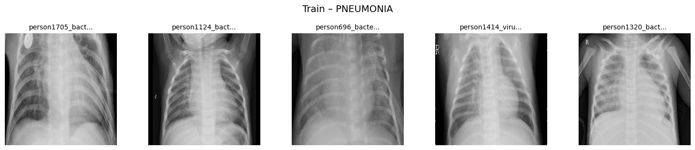
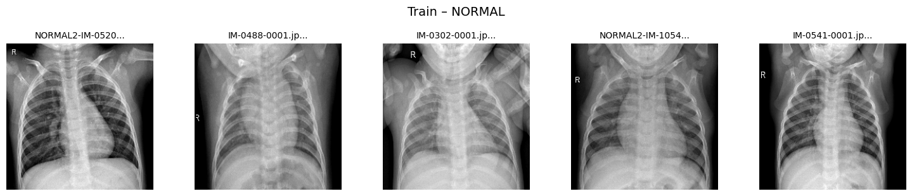
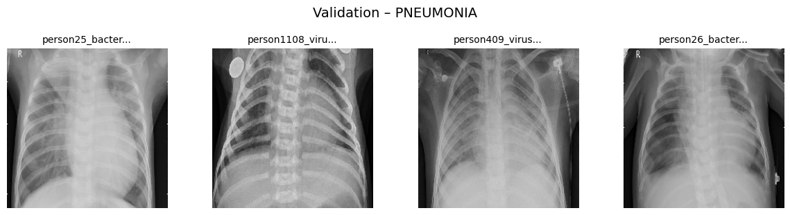
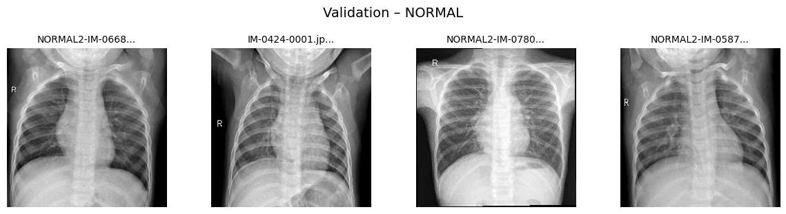
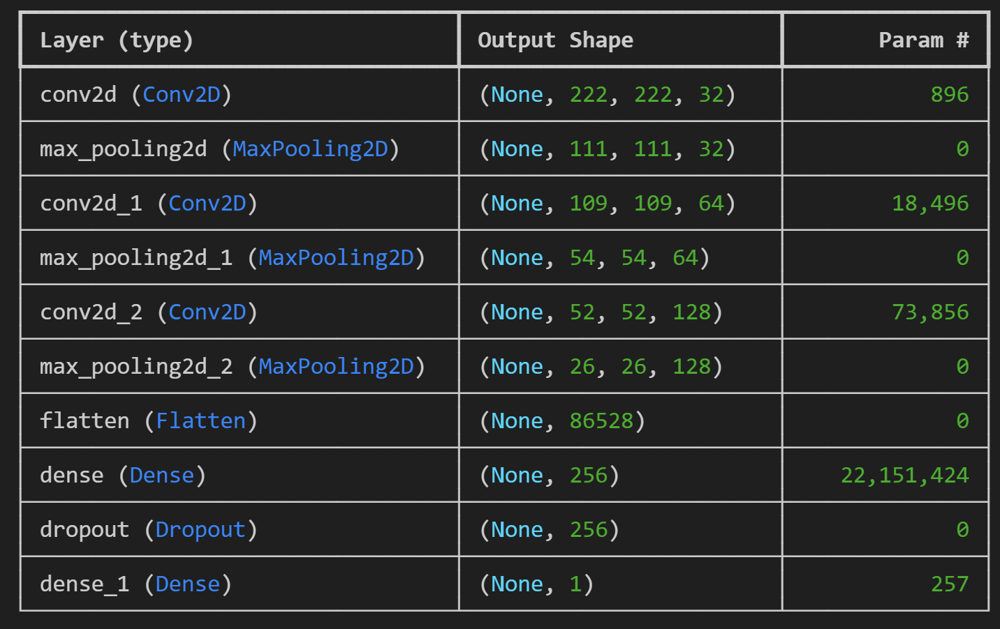
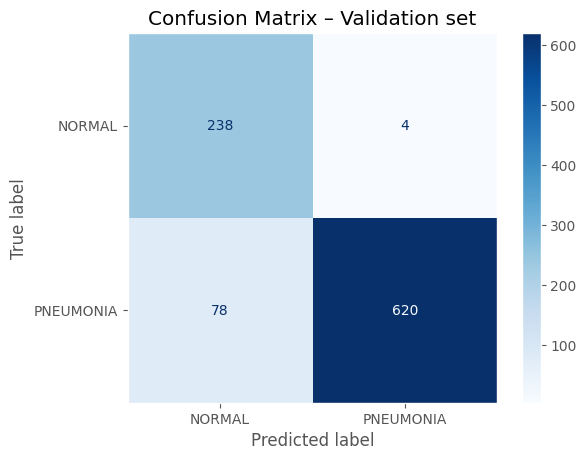
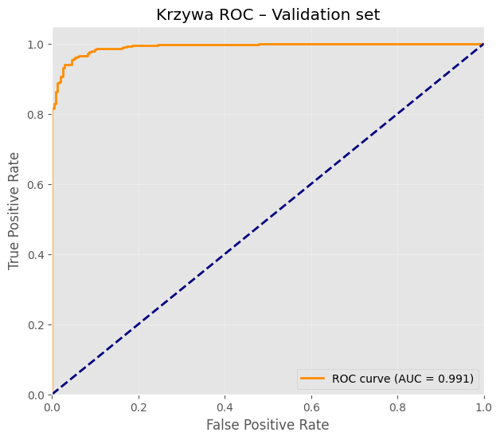
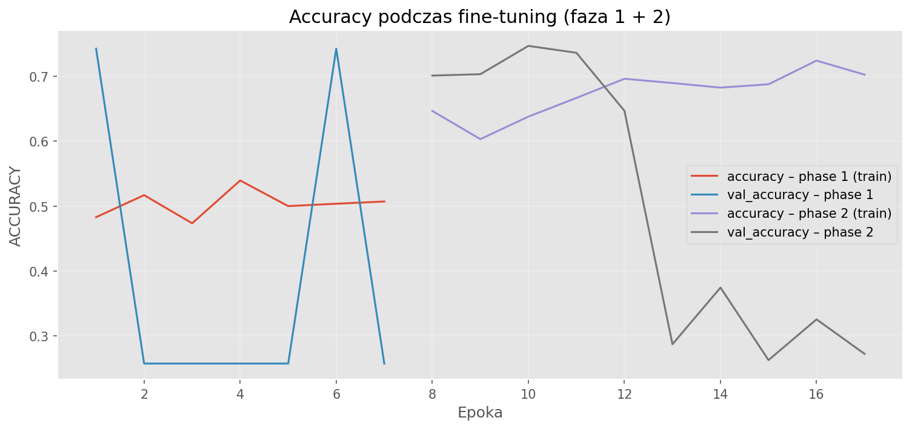
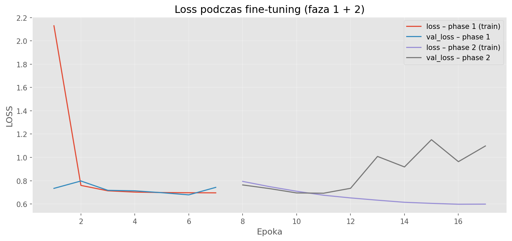

# 🫁 Pneumonia Detection from Chest X-Ray Images

End-to-end deep learning project for binary classification: **NORMAL** vs **PNEUMONIA** using TensorFlow 2.19 and Keras.  
Demonstrates handling of severe class imbalance, transfer learning, model explainability and cloud training on AWS SageMaker.

## Dataset Details

- **Source**: <a href="https://www.kaggle.com/datasets/paultimothymooney/chest-xray-pneumonia" target="_blank">Kaggle - Chest X-Ray Pneumonia Dataset</a>  
- **Total images**: 5,863  
- **Classes**: NORMAL / PNEUMONIA  
- **Original splits**:  
  - Train: 5,218 images (1,342 NORMAL | 3,876 PNEUMONIA) → **ratio 2.89 : 1**  
  - Original validation: only 18 images (9+9) → discarded  
  - Test: 624 images (234 NORMAL | 390 PNEUMONIA) → **ratio 1.67 : 1**  
- **Custom validation split**: 82/18 from train → 940 images (242 NORMAL | 698 PNEUMONIA)

### Key Dataset Challenges

- Severe class imbalance (PNEUMONIA dominates ~79%)  
- Extremely small original validation set  
- Grayscale images with varying brightness, contrast, hospital artifacts

## Visual Examples from Dataset

**Train – PNEUMONIA**  

**Train – NORMAL**  

**Validation – PNEUMONIA**  

**Validation – NORMAL**  

## Baseline CNN Architecture

Simple convolutional network used as reference point before transfer learning.

## Baseline Results – Validation Set

**Confusion Matrix – Validation**  

**ROC Curve – Validation (AUC = 0.991)**  

## Fine-Tuning with EfficientNetV2B0

Two-phase approach:  
1. Frozen backbone → training classifier head  
2. Partial unfreeze + very low learning rate

**AUC during fine-tuning (phase 1 + 2)**  

**Accuracy during fine-tuning (phase 1 + 2)**  

**Loss during fine-tuning (phase 1 + 2)**  

## Technologies & Tools

- TensorFlow 2.19 | Keras  
- EfficientNetV2B0 (transfer learning)  
- AWS S3 (data storage) | SageMaker Training Job (GPU training)  
- ImageDataGenerator | class_weight | threshold tuning | Grad-CAM  
- Python | NumPy | Pandas | Matplotlib | Seaborn

## Key Takeaways

- Severe class imbalance (2.89:1) and tiny original validation set required custom splitting, class weighting and threshold tuning  
- Baseline CNN achieved high AUC but very low recall for minority class  
- Transfer learning + augmentation + threshold optimization improved recall to ~0.85–0.95  
- Grad-CAM confirmed model attention on clinically relevant areas (lungs, opacities)  
- AWS SageMaker enabled fast, cost-effective GPU training (~3–8 USD)

This project demonstrates end-to-end ML workflow, understanding of medical data challenges and iterative improvement from weak baseline to clinically meaningful performance.

**Project by**: Sławomir Strzelec  
**Date**: February 2026  
**Portfolio**: <a href="https://slastrzelec.github.io/portfolio/" target="_blank">slastrzelec.github.io/portfolio</a>

---

*Case Study by Sławomir Strzelec*  
*Portfolio Project | February 2026*  
*TensorFlow 2.19.1 | Python 3.9+*