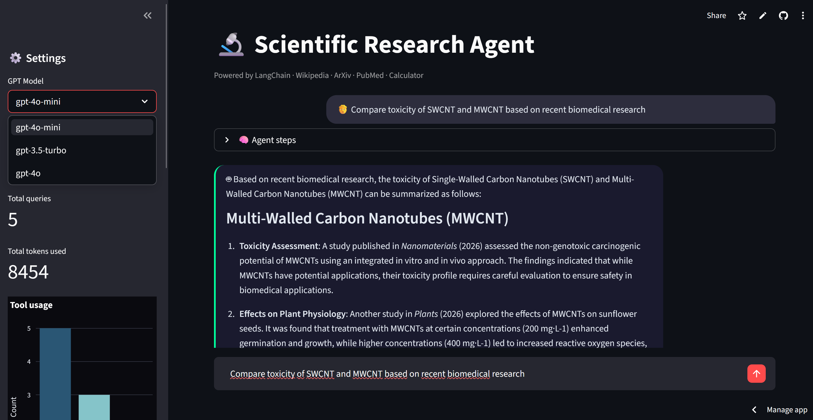

# 🤖 Scientific Research Agent  
**Autonomous AI Agent with LangChain, LangGraph, LangFuse & Streamlit**

---

## 🚀 Live Demo

<a href="https://research-agent-langchain.streamlit.app/" target="_blank">▶️ Open Live App</a>


---

## 📌 Project Overview

**Scientific Research Agent** is an AI-powered research assistant that autonomously answers scientific questions by selecting and calling the most appropriate external tool.

The project demonstrates a complete **LLM Agent pipeline**, covering tool selection, ReAct reasoning loop, conversation memory, observability, and interactive deployment as a web application.

It was designed as an **end-to-end portfolio project**, showcasing expertise in LLM engineering, agentic systems, and production-grade AI application development.

---

## 🎯 Features

- 🔍 **4 research tools**: Wikipedia, ArXiv, PubMed, Calculator
- 🧠 **Autonomous tool selection** — agent decides which tool fits the question
- 💬 **Conversation memory** — context preserved within a session
- 🗄️ **SQLite logging** — every query saved with tokens used and tools called
- 📊 **Tool usage statistics** — interactive bar chart in sidebar
- 📡 **LangFuse observability** — full trace monitoring, latency, and cost tracking
- ⬇️ **CSV export** — download full conversation history
- ⚙️ **GPT model selector** — switch between gpt-4o-mini, gpt-3.5-turbo, gpt-4o

---

## 🧠 Agent Architecture

- **Pattern**: ReAct (Reasoning + Acting)
- **Framework**: LangChain + LangGraph
- **LLM**: OpenAI GPT-4o-mini
- **Observability**: LangFuse

### ReAct Loop
```
User Question
     ↓
LLM reasons which tool to use
     ↓
Tool is called (Wikipedia / ArXiv / PubMed / Calculator)
     ↓
LLM observes the result
     ↓
Final Answer
```

Every step is traced in LangFuse for full production observability.

---

## 🔧 Tools

| Tool | Source | Use Case |
|---|---|---|
| Wikipedia | `langchain-community` | General scientific concepts |
| ArXiv | `langchain-community` | Recent research papers |
| PubMed | NCBI E-utilities API | Biomedical & clinical research |
| Calculator | Custom `@tool` | Mathematical calculations |

---

## 🖥️ Web Application

- **Framework**: Streamlit
- **Key aspects**:
  - Chat bubble style UI
  - Agent reasoning steps visible per query
  - Session state management for conversation history
  - Sidebar with live statistics and export
  - Deployed on Streamlit Community Cloud

---

## 🧰 Tech Stack

- **Python 3.11**
- **LangChain + LangGraph** – agent framework
- **OpenAI API** – GPT-4o-mini
- **LangFuse** – LLM observability
- **Streamlit** – web deployment
- **SQLite** – conversation logging
- **Plotly / Pandas** – data visualization
- **Git & GitHub**

---

## 🚀 Use Cases

- Scientific literature research automation
- AI agent development reference
- LLM observability and monitoring demo
- LangChain / LangGraph portfolio showcase
- Technical interviews for AI Engineer roles

---

## 📂 Repository

🔗 <a href="https://github.com/slastrzelec/17_research-agent-langchain" target="_blank">GitHub Repository</a>

---

## 👨‍💻 Author

**Sławomir Strzelec**  
Data Scientist | Machine Learning Practitioner  

- 📍 Kraków, Poland  
- 💼 <a href="https://www.linkedin.com/in/sławomir-strzelec" target="_blank">LinkedIn</a>  
- 💻 <a href="https://github.com/slastrzelec" target="_blank">GitHub</a>  

---

## 📌 Project Status

✅ Completed & Deployed  

🔧 Potential extensions:
- Persistent database (PostgreSQL / Supabase)
- LangFuse evaluations and scoring
- Multi-agent pipeline (LangGraph multi-node)
- Docker deployment
- User authentication