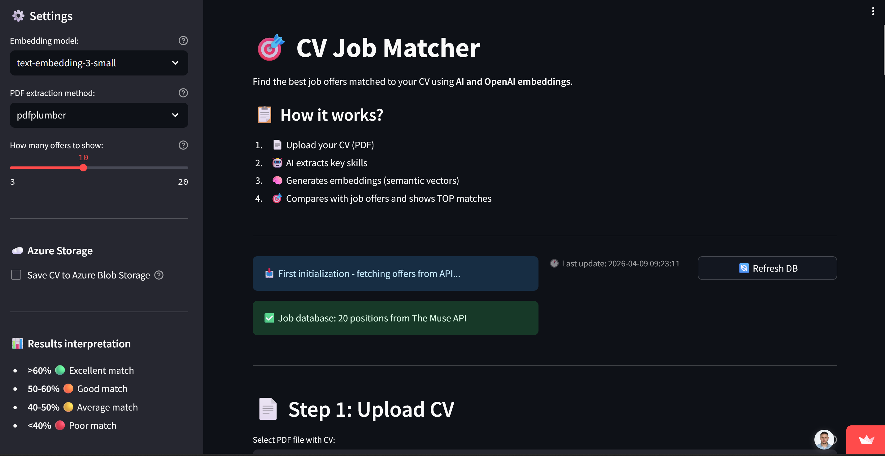

# 🎯 CV Job Matcher

**AI-Powered CV Matching with OpenAI Embeddings, Streamlit**

---


## 🚀 Live Demo

[▶️ Open Live App](https://cv-matching-openai-embeddings.streamlit.app/)

---

## 📌 Project Overview

**CV Job Matcher** is an AI-powered web application that semantically matches a candidate's CV to real job offers using OpenAI embeddings and cosine similarity.

The project was built as an **end-to-end portfolio project**, covering the full pipeline from PDF text extraction, through LLM-based skills condensation, semantic vector matching, to cloud deployment on Azure — demonstrating practical skills in AI integration, cloud storage, and production deployment.

It was designed bottom-up: starting with **3 exploratory Jupyter notebooks** to empirically validate each component before assembling the final Streamlit application.

---

## 🎯 Features

- 📄 **PDF CV extraction** — dual-library support: pdfplumber (default) and PyPDF2
- 🤖 **AI skills extraction** — GPT-4o-mini condenses full CV into a concise skills summary before embedding
- 🧠 **Semantic matching** — OpenAI `text-embedding-3-small` (1536-dim vectors) + cosine similarity
- ☁️ **Azure Blob Storage** — uploaded CVs persisted to `cv-uploads` container with timestamp naming
- 🔄 **Live job data** — real-time offers from The Muse API (ML, DS, Python, AI, Deep Learning categories)
- 📊 **CSV export** — download ranked match results
- ⚡ **Cache TTL=1h** — minimizes API token costs across user sessions

---

## 🧠 Pipeline Architecture

```
[Upload PDF]
      ↓
[pdfplumber → raw text ~9 600 chars]
      ↓
[GPT-4o-mini → skills condensation ~400 chars]
  "Python, PyTorch, scikit-learn, Azure,
   time series, ETL pipelines, OpenAI API..."
      ↓
[text-embedding-3-small → vector 1536-dim]
CV skills → [−0.023, −0.008, 0.003, ...]
      ↓
[The Muse API → live job offers]
  deduplicated by job.id, cached TTL=1h
      ↓
[text-embedding-3-small → job vectors]
  title + description + requirements → vector
      ↓
[cosine_similarity (scikit-learn)]
  sim(cv_vector, job_vector) → score 0.0–1.0
      ↓
[Ranked results + CSV export]
      ↓
[Azure Blob Storage]
  CV saved as {timestamp}_{filename}
```

---

## 💡 Key Design Decisions

**Why GPT-4o-mini before embedding?**
Full CV contains ~9 600 characters of noise — dates, formatting, project descriptions. Embedding raw CV produces noisier vectors. GPT-4o-mini reduces it to ~400 characters of pure skills signal, significantly improving matching quality. Validated empirically in notebook `02_embeddings_test.ipynb`.

**Why cosine similarity over dot product?**
OpenAI embeddings are L2-normalized (vector norm = 1.0), so cosine similarity is equivalent to dot product — but cosine similarity is robust to text length differences between CV and job descriptions.

**Why Azure Blob Storage?**
Azure Web App is stateless — files written to local disk are lost on restart. Blob Storage ensures CV persistence across deployments and provides an audit trail of uploaded files.

**Why cache TTL=1h on job offers?**
Each embedding call costs tokens. Caching prevents redundant API calls when multiple users refresh the app within the same hour window.

---

## 🔧 Notebooks (Research Phase)

| Notebook | Purpose | Key Finding |
|---|---|---|
| `01_pdf_extraction.ipynb` | Compared PyPDF2 vs pdfplumber | pdfplumber produces cleaner text (fewer formatting artifacts) |
| `02_embeddings_test.ipynb` | Tested embedding strategies | Skills-only embedding outperforms full CV embedding; validated norm=1.0 |
| `03_justjoin_api.ipynb` | Tested job data sources | The Muse API chosen; deduplication by job.id implemented |

---

## 📊 Results

Match scores from notebook validation (CV vs sample job offers):

| Rank | Job Title | Match Score |
|---|---|---|
| 🥇 | Senior Machine Learning Engineer | 61.37% |
| 🥈 | AI Research Engineer | 49.76% |
| 🥉 | Data Scientist | 49.53% |
| 4 | Python Backend Developer | 49.10% |
| 5 | Junior Python Developer | 44.70% |

> **Note:** Scores of 60%+ indicate strong semantic alignment. Cosine similarity between embedding vectors does not reach 90%+ for typical text pairs — the model correctly ranked the most relevant role first.

---

## 🧰 Tech Stack

- **Python 3.11**
- **Streamlit** — web frontend and deployment UI
- **OpenAI API** — `GPT-4o-mini` (skills extraction) + `text-embedding-3-small` (embeddings)
- **scikit-learn** — `cosine_similarity` for vector matching
- **Azure Blob Storage** — CV file persistence (SDK v12)
- **Azure Web App** — production deployment (App Service)
- **pdfplumber / PyPDF2** — PDF text extraction
- **The Muse API** — live job listings
- **python-dotenv** — environment configuration
- **Pandas** — results export to CSV

---

## 🚀 Use Cases

- Job seekers wanting to quickly assess CV fit before applying
- AI/ML similarity search reference implementation
- Azure cloud + OpenAI integration portfolio showcase
- Semantic search demo with real-world data
- Technical interviews for AI Engineer / Data Engineer roles

---

## 🔧 Potential Extensions

- **Pre-computed job embeddings** stored in Azure AI Search — eliminates per-session embedding cost
- **Azure Key Vault** — replace `.env` secrets with managed identity
- **GitHub Actions CI/CD** — automated deployment pipeline
- **Hybrid search** — combine cosine similarity with BM25 keyword matching
- **Azure Application Insights** — monitor match distributions and API usage
- **FastAPI backend** — decouple embedding logic from Streamlit frontend

---

## 📂 Repository


🔗 <a href="https://github.com/slastrzelec/-azure-cv-matching-openai-embeddings" target="_blank">GitHub Repository</a>
---

## 👨‍💻 Author

**Sławomir Strzelec**  
Data Scientist | Machine Learning Practitioner

- 📍 Kraków, Poland
- 💼 [LinkedIn](https://www.linkedin.com/in/sławomir-strzelec)
- 💻 [GitHub](https://github.com/slastrzelec)

---

## 📌 Project Status

✅ Completed & Deployed on Azure Web App

🔧 Potential next steps:
- Pre-computed embeddings in Azure AI Search
- Key Vault + Managed Identity for secrets
- CI/CD via GitHub Actions
- Hybrid search (cosine + BM25)
