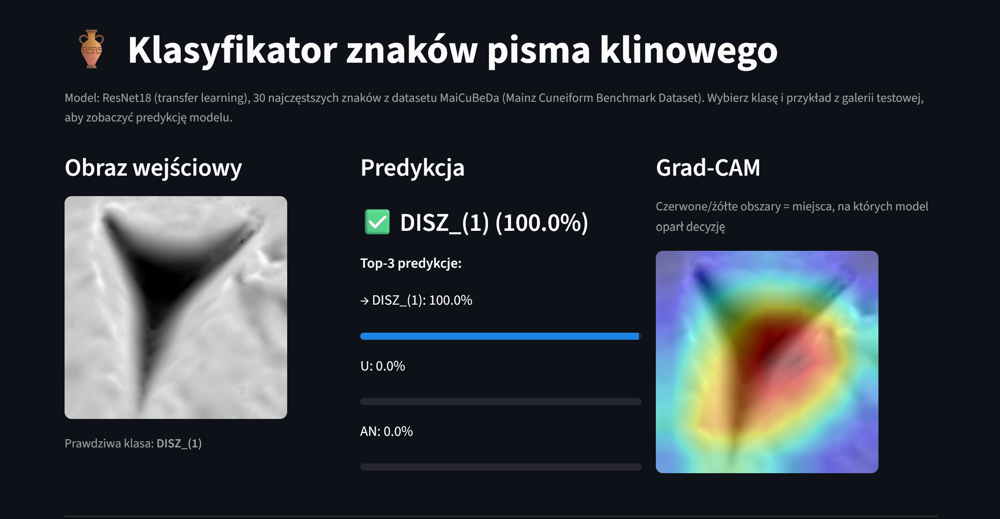

# 🏺 Cuneiform Sign Classifier

**Classifying individual cuneiform signs (Sumerian/Akkadian) on 3D-rendered clay tablet images, using transfer learning — a digital humanities application connecting deep learning with paleography.**

**Live demo:** <a href="https://cuneiform-sign-classifier.streamlit.app/" target="_blank">cuneiform-sign-classifier.streamlit.app</a> · <a href="https://github.com/slastrzelec/cuneiform-sign-classifier" target="_blank">GitHub Repository</a>

*The Streamlit demo: pick a test example, see the top-3 predictions with confidence, and a Grad-CAM overlay showing which part of the sign the model based its decision on.*

## Why this project

Cuneiform is one of the oldest writing systems in the world and still an active area of digital humanities research. Instead of another generic image classifier, this project tackles a niche, genuinely challenging dataset: a long-tailed class distribution, inconsistent metadata, and a domain where a standard computer-vision trick (horizontal flip augmentation) is actually a methodological error — mirroring a cuneiform sign changes its identity.

## Results at a glance

| Metric | Result |
|---|---|
| Number of classes | Top 30 most frequent signs |
| Test accuracy | 90.4% |
| Test macro-F1 | 0.896 |
| Model | ResNet18 (transfer learning), CPU-only |
| Dataset | MaiCuBeDa Hilprecht (28.7k annotated signs, CC BY-SA 4.0) |

## Methodology

- **Train/val/test split (70/15/15) grouped by tablet**, not by individual image — the same sign from the same tablet never ends up in two splits at once. Verified with 8 automated data-integrity tests (`tests/test_no_leakage.py`), run on every push via GitHub Actions.
- **Class weights** (inverse frequency) in the loss function to handle the ~5x imbalance between the most and least frequent of the top-30 classes.
- **Model selected by macro-F1 on validation, not accuracy** — to avoid favoring the most frequent classes.
- **Augmentation without mirror flips.** A standard `RandomHorizontalFlip` would be a methodological error here — mirroring a cuneiform sign changes its identity. Only small rotation (±8°) and light brightness/contrast jitter were used.
- **Transfer learning with partial freezing** — ResNet18's early layers frozen, later layers and the classifier head trained, as a quality/training-time trade-off for CPU-only training.

## Discovery: paleographic drift of the sign `U`

Exploratory analysis revealed that the sign `U` (the number "10") has a **physically different form** depending on the historical period: a round indentation in the oldest tablets (ED IIIb, ca. 2500–2340 BC) vs. a clear triangular wedge in later periods — a documented paleographic phenomenon from an era when scribes partly used a round stylus for writing numbers.

This was verified two independent ways:

- **Quantitatively:** accuracy for `U` is 100% across every later period, but drops to 43% (3/7) specifically for the oldest period, ED IIIb.
- **Geometrically:** t-SNE on the model's 512-dimensional feature space shows the sign `U` forming **two separate clusters** corresponding to the two graphical variants — while a sign without this drift (`ASZ`) forms one coherent cluster.

*t-SNE visualization of the model's feature space for four signs. `U` (top-left) splits into two clusters by historical period — the model "sees" the same graphical variation a paleographer notices visually — while `ASZ` (top-right) stays coherent.*

The model wasn't told about paleography — it discovered a real historical fact about how the sign's shape changed over roughly 500 years, purely from learning to classify images. This is a case where an ML side-effect (an embedding-space anomaly) pointed to something genuinely interesting in the domain, not just a modeling artifact.

## Confusion matrix

*A clean diagonal — errors are rare and concentrated (e.g. `LUGAL→LU2`, `A↔MIN_(2)`), explainable by visual similarity between the signs' graphical components rather than random noise.*

## Tech stack

- **Deep Learning:** PyTorch, torchvision (ResNet18, transfer learning)
- **Interpretability:** Grad-CAM (custom implementation), t-SNE embeddings
- **App:** Streamlit, with the trained checkpoint served from the Hugging Face Hub
- **Testing:** pytest (8 dataset-integrity tests), GitHub Actions CI
- **Deployment:** Streamlit Community Cloud + Hugging Face Hub (model hosting)

## Data quality issue encountered

The metadata CSV's filename field didn't match the actual filenames in the published image archive (a dataset-versioning artifact). Solved by parsing filenames directly from disk and mapping each sign's transliteration to its class name via a separate lookup table built from the metadata (923 unique readings, only 18 ambiguous, resolved by majority vote).

## Limitations

- Only the top-30 classes — the full cuneiform sign inventory has hundreds of signs with a strong long tail (93 classes have only 1 example in the entire dataset).
- Imbalance across historical periods (64% of the data is from the Ur III period) limits generalization to older graphical variants — directly documented via the sign `U` above.
- Classification, not detection — the model assumes the sign has already been cropped from the tablet.

## Author's note

A deliberate departure from the chemistry-heavy projects elsewhere in this portfolio — same underlying discipline (rigorous methodology, honest error analysis, domain knowledge driving modeling choices), applied to a completely different field.
