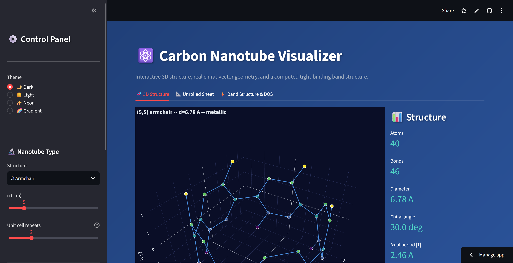

# ⚛️ Carbon Nanotube Visualizer

🚀 **Live Demo:** <a href="https://nanotubes.streamlit.app/" target="_blank">nanotubes.streamlit.app</a>

## 🎯 Project Goal

An interactive tool for exploring the atomic structure and electronic properties of
single-walled carbon nanotubes (SWCNTs), driven entirely by their chiral indices
**(n, m)**. Pick a nanotube — Armchair, Zigzag, Chiral, or a custom (n, m) pair —
and get its rolled-up 3D geometry, an unrolled graphene-sheet diagram, and a
computed electronic band structure, all interactively.

This is a rebuild of an earlier, matplotlib-based version. The original only
computed real chiral-vector geometry for the "custom (n,m)" mode — its
Armchair/Zigzag/Chiral presets used a simplified ring-stacking heuristic that
didn't implement the physics the UI claimed. This version replaces that with
**one** geometry engine for all four modes, built on ASE's peer-reviewed
nanotube builder, plus a genuine tight-binding electronic-structure calculation
instead of just printing a classification rule.

## 🛠️ Key Technologies and Libraries

| Category | Tool / Library | Role in the Project |
| :--- | :--- | :--- |
| **Structure generation** | **ASE** (Atomic Simulation Environment) | Peer-reviewed nanotube builder used as the single source of truth for atomic coordinates, cross-checked against closed-form diameter/period formulas. |
| **Bonding** | **SciPy** (`cKDTree`) | Correct, O(N log N) nearest-neighbor bond detection by real interatomic distance, replacing index-based ring heuristics. |
| **Electronic structure** | **NumPy** | First-principles nearest-neighbor tight-binding band structure, computed by zone-folding the graphene dispersion onto the tube's allowed k-vectors. |
| **Visualization** | **Plotly** | Interactive 3D rendering (rotate / zoom / pan / hover) for the structure, unrolled sheet, band structure, and density of states. |
| **Web Application** | **Streamlit** | Live, interactive web interface with cached geometry/bonding/electronic calculations. |

## ⚙️ Core Technical Features

### 1. Real chiral-vector geometry, for every preset

Every nanotube — armchair, zigzag, chiral, or custom (n, m) — is generated by
the same engine: ASE's `ase.build.nanotube`, wrapped with metadata (diameter,
chiral angle, axial period, metallic/semiconducting classification). Two
independent closed-form checks (diameter and translation-period formulas from
chiral-vector theory) are run against every generated structure as regression
tests, so the geometry can't silently drift.

$$D = \frac{a \cdot |\vec{C}|}{\pi} = \frac{\sqrt{3} \cdot a_{cc} \cdot \sqrt{n^2 + nm + m^2}}{\pi}$$

### 2. A real electronic-structure calculation, not just a rule

The classic $(n-m) \bmod 3 = 0$ metallic/semiconducting rule only gives a
label. This project actually *computes* the band structure: a nearest-neighbor
tight-binding Hamiltonian is built from graphene's three real bond vectors,
its dispersion is zone-folded onto the discrete set of k-vectors allowed by
the tube's circumference (reciprocal lattice vectors solved numerically from
the chiral and translation vectors), and the resulting bands and density of
states are plotted directly. The computed gap was validated against 10
diverse (n, m) pairs, including armchair tubes — a case where a naively
memorized "compact" gap formula turns out to give the wrong answer.

### 3. Interactive 3D rendering with real physical context

- **3D structure**: ball-and-stick / wireframe / space-filling / stick
  rendering in Plotly, with full mouse rotate/zoom/pan and per-atom hover,
  across four visual themes.
- **Unrolled graphene sheet**: the textbook diagram — the flat honeycomb
  lattice with the chiral vector **C** and translation vector **T** drawn on
  it, showing exactly what gets rolled into the tube.
- **Band structure & DOS**: interactive plots of the computed π/π* bands and
  density of states, with the displayed metallic/semiconducting label driven
  by the exact integer rule (the numeric band-gap minimum on a finite k-grid
  is shown separately, labeled as a resolution artifact rather than a "gap").

### 4. Export for downstream tools

XYZ and PDB (with `CONECT` bond records) export always work, for opening the
generated structure in PyMOL, VMD, or Avogadro. PNG/SVG/PDF image export is
also available where the hosting environment provides a Chrome binary
(via `kaleido`); the app detects when it isn't available and disables those
buttons gracefully instead of crashing.

## ✅ Skills Demonstrated in This Project

* **Computational physics**: chiral-vector nanotube theory and nearest-neighbor
  tight-binding electronic structure, implemented from first principles and
  validated against known physical results rather than assumed correct.
* **Scientific software correctness**: cross-checking a geometry/physics
  engine against independent closed-form formulas and a real reference
  library (ASE), with a test suite that encodes physical ground truth
  (bond lengths, atom counts, band-gap rules) rather than just "it runs".
* **Interactive data visualization**: building a responsive, themeable
  Plotly-based interface for 3D scientific structures and electronic-structure
  plots inside Streamlit.
* **Defensive engineering**: graceful degradation when an optional runtime
  dependency (a Chrome binary for image export) isn't available, verified
  with headless UI tests (`streamlit.testing.v1.AppTest`) rather than assumed.

---

See the [project's `SPEC.md`](https://github.com/slastrzelec/carbon-nanotube-visualizer/blob/main/SPEC.md)
for the full technical rationale and physics references (Saito, Dresselhaus &
Dresselhaus, *Physical Properties of Carbon Nanotubes*; Iijima, *Nature*, 1991).
