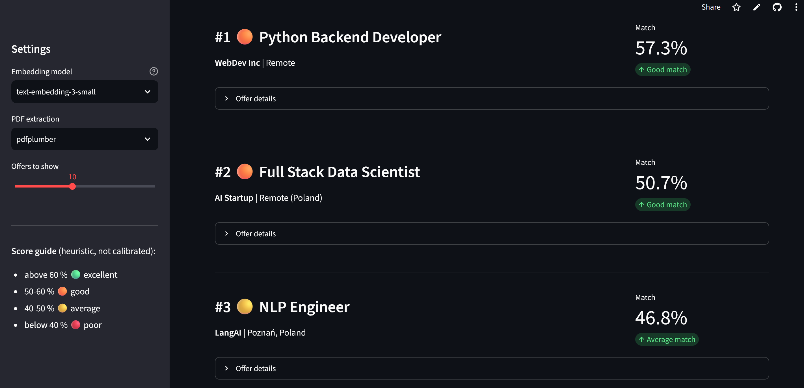

# 🎯 CV Job Matcher

**Embedding-based CV to job-offer matching with OpenAI and Streamlit — with a privacy-first data flow and a test suite that needs no API key**

---

*Ranking of the bundled fictional sample offers for one CV. Scores are cosine similarities of OpenAI embeddings; the bands are heuristic.*

## 🚀 Live Demo

[▶️ Open Live App](https://cv-matching-openai-embeddings.streamlit.app/) (Streamlit Community Cloud; the app sleeps when idle and wakes up with one click)

---

## 📌 Project Overview

**CV Job Matcher** ranks job offers against a CV. An LLM (`gpt-4o-mini`) condenses the CV into a short list of technical skills; the skills and the offers are embedded with `text-embedding-3-small/large`; offers are ranked by cosine similarity. Offers come from The Muse public API.

It is a **demonstration of an embedding pipeline, not a validated recommender**: there is no labelled relevance data, so match quality has not been measured, and the 60/50/40 % score bands are heuristic. The value of the project is the engineering around it: batching, caching, failure handling, privacy, and tests.

It was built bottom-up: three exploratory notebooks to try each component, then the Streamlit application, then a hardening release (privacy, correctness, tests, CI) driven by a written specification.

---

## 🔒 What happens to your CV

| Step | What happens |
|---|---|
| Upload | PDF read **in memory** (max 5 MB, first 10 pages); never written to disk |
| Skills extraction | CV text (max 20,000 characters) is **sent to OpenAI**; the UI says so |
| Matching | only the short skills summary is embedded |
| Storage | **nothing is stored.** The app has no storage code and no cloud-storage dependency |

An earlier version could store uploaded CVs in cloud storage and listed recent file names to all visitors. That code was removed entirely in the hardening release because it exposed other people's data.

---

## 🧠 Pipeline

```
[Upload PDF] → in-memory text extraction (pdfplumber / pypdf)
      ↓
[gpt-4o-mini] → skills summary (~400 characters)
      ↓
[text-embedding-3-small] → CV vector (1536-dim)
      ↓
[The Muse API / cached file / bundled sample offers]
      ↓
[batched embeddings, up to 100 texts per request, cached 1 h]
      ↓
[cosine similarity (NumPy)] → ranked offers + CSV export
```

---

## 💡 Key Design Decisions

**Why condense the CV before embedding?** A full CV contains dates, formatting and project prose that dilute the vector. In a small exploratory comparison on 5 fictional offers the condensed version ranked the expected role first; this is an observation, not a proven effect.

**Why is a failed embedding request fatal?** The first version skipped an offer whose embedding failed but kept it in the list, so `zip(jobs, similarities)` attached scores to the wrong offers — a silent wrong ranking. Embedding is now all-or-nothing: on failure the app shows an error and no ranking. `rank_jobs` also raises if the two lists differ in length.

**Why batching and caching?** One request per offer meant 100+ API calls per click. Offers are now embedded in batches of up to 100 and cached for an hour per offer set.

**Why does the first start never call the network?** It uses the cached file or the bundled **fictional** sample offers (and says so in the UI); the network is used only on *Refresh DB*.

**Why treat external data as untrusted?** Job titles and links come from a third party: only `http(s)` links are rendered and CSV cells that start with `=`, `+`, `-`, `@` are neutralised (spreadsheet formula injection).

---

## 🧪 Testing

**38 automated tests run on every push and pull request** (GitHub Actions, Python 3.11, plus `ruff`). They need no API key and no network: OpenAI is replaced by a deterministic fake client.

- **Ranking:** ordering, length mismatch raises, input not mutated, rating thresholds.
- **Embeddings:** batching (calls = ceil(n/100)), row *i* belongs to text *i* even when the API returns items out of order, a failed request raises instead of returning partial results, long and empty texts.
- **PDF:** text extraction from generated PDFs with both libraries, garbage input, page limit.
- **Job data:** HTML stripping, payload formatting, de-duplication, network errors, `javascript:` links dropped, cache/sample fallback.
- **Privacy rules:** no "Recent CVs" in the UI, no storage option, and no storage module or cloud-storage dependency in code, requirements, workflows or settings.
- **App:** Streamlit `AppTest` runs the whole script, including matching end to end and "no ranking on embedding failure".
- **Repository hygiene:** no `.env`, PDF or generated files tracked; no e-mail address or phone number in tracked notebook outputs.

Mutation checks (re-introducing the length-mismatch bug, swallowing a failed embedding batch, removing the CSV neutralisation, bringing back the CV list, adding cloud-storage code) each make the suite fail.

**Not covered:** the real OpenAI and The Muse APIs, match quality (no ground truth), and uploading a file through the browser widget.

---

## 📊 Illustration on sample offers

Scores from the exploratory notebook (a CV against 5 **fictional** sample offers). This shows that the pipeline runs and ranks plausibly, not how good it is on real data:

| Rank | Job Title | Match Score |
|---|---|---|
| 🥇 | Senior Machine Learning Engineer | 61.37% |
| 🥈 | AI Research Engineer | 49.76% |
| 🥉 | Data Scientist | 49.53% |
| 4 | Python Backend Developer | 49.10% |
| 5 | Junior Python Developer | 44.70% |

> `text-embedding-3` similarities are compressed (rarely above 0.7), so the percentages are relative and the bands are heuristic.

---

## 🧰 Tech Stack

- **Python 3.11**, **Streamlit**
- **OpenAI API** — `gpt-4o-mini` (skills extraction), `text-embedding-3-small/large` (embeddings)
- **NumPy** — cosine similarity; **pandas** — CSV export
- **pdfplumber / pypdf** — PDF text extraction
- **The Muse API** — live job listings
- **pytest, ruff, GitHub Actions, Dependabot** — tests, lint, CI, dependency updates

---

## 🔗 Related Projects

- [Scientific Research Agent](../research-agent-langchain/index.md) — another OpenAI-based application, tested with a scripted fake model and no API key; it also carries a measured evaluation, which this project lacks.
- [Carbon Nanotubes RAG System](../carbon-nanotubes-rag/index.md) — embeddings and semantic search with a measured retrieval quality (RAGAs).

---

## ⚠️ Limitations

- Match quality is unmeasured and the notebook comparison is based on 5 fictional offers.
- The Muse API returns mostly US-centric offers and only the first page (20) per search term.
- The CV text is processed by a third party (OpenAI); this is stated in the UI.

---

## 📂 Repository

🔗 <a href="https://github.com/slastrzelec/azure-cv-matching-openai-embeddings" target="_blank">GitHub Repository</a>

---

## 👨‍💻 Author

**Sławomir Strzelec**  
Data Scientist | Machine Learning Practitioner

- 📍 Kraków, Poland
- 💼 [LinkedIn](https://www.linkedin.com/in/sławomir-strzelec)
- 💻 [GitHub](https://github.com/slastrzelec)

---

## 📌 Project Status

✅ Hardened and tested; live demo on Streamlit Community Cloud.

🔧 Possible next steps:
- A small labelled set of CV/offer pairs to measure ranking quality
- Pre-computed offer embeddings in a vector store
- Hybrid search (cosine + BM25)
