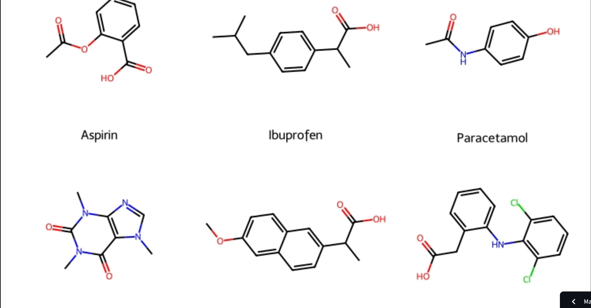

# 💊 Drug Solubility Prediction using Machine Learning

## Overview

The **Drug Solubility Prediction Tool** is a machine learning application built with Streamlit (and a FastAPI service) that predicts aqueous solubility of pharmaceutical compounds. This project combines **cheminformatics** knowledge with modern **machine learning** engineering practice to solve a real problem in drug development.

Given a drug's chemical structure (SMILES notation), the model predicts how well it will dissolve in water, which is crucial for determining drug bioavailability and efficacy. The model combines Morgan fingerprints with RDKit physicochemical descriptors, feature selection, and an XGBoost regressor trained on 1,144 pharmaceutical compounds — then validated against a second, independent dataset before being trusted.

🚀 **Live Demo:** <a href="https://drug-solubility-prediction.streamlit.app/" target="_blank">Try the Streamlit app</a>

📋 **Some key results from the project:**

## 🎯 Model Performance

| Metric | Value |
|--------|-------|
| **Best Algorithm** | XGBoost |
| **Test R² Score** | 0.9116 (91% variance explained) |
| **Test RMSE** | 0.6203 log(mol/L) |
| **Test MAE** | 0.4824 log(mol/L) |
| **External validation (AqSolDB, 8,881 compounds)** | R² = 0.6381 |
| **Dataset Size** | 1,144 compounds (ESOL) |
| **Features** | 2,048 Morgan fingerprint bits + 7 RDKit descriptors, 1,028 selected |

## 🔬 Feature Engineering

**Morgan Fingerprints + physicochemical descriptors** — the fingerprint encodes:
- Molecular connectivity patterns
- Atomic neighborhoods at different radii
- Specific chemical substructures

...alongside 7 RDKit descriptors (molecular weight, LogP, TPSA, H-bond donor/acceptor counts, rotatable bonds, aromatic rings). Feature selection (`SelectFromModel`, fit on the training fold only) narrows 2,055 features down to 1,028.

Key insight: **LogP alone accounts for 17.5% of feature importance** — more than the next 5 fingerprint bits combined — consistent with LogP's well-established role in aqueous solubility (Yalkowsky's General Solubility Equation). Adding physicochemical descriptors, not just a bigger model, was the single biggest lever for accuracy.

## 📊 Model Comparison

Four algorithms were compared via 5-fold cross-validation (train set only):

```
SVR                     🟡  CV R² = 0.732
Random Forest           ✅  CV R² = 0.852
Gradient Boosting       ✅  CV R² = 0.887
XGBoost                 🏆  CV R² = 0.893  ← BEST
```

XGBoost was refit on the full training set and evaluated once on the held-out test set: **R² = 0.9116**, a substantial jump from an earlier fingerprint-only Random Forest baseline (R² = 0.6985) — and the train/test gap shrank from 0.24 to 0.06, meaning this is better generalization, not just a better fit.

## 🌍 External Validation

Rather than stopping at the in-distribution test score, the model was also evaluated on **AqSolDB** (Sorkun et al., 2019) — 8,881 compounds never seen during training, after removing 1,099 that overlap with the ESOL training data by canonical SMILES. Result: **R² = 0.638**, reported honestly alongside the 0.91 in-distribution score rather than blended into one number. The gap shows how much accuracy depends on staying close to the training distribution — exactly the kind of check that's easy to skip and easy to regret skipping.

## 🎯 Prediction Uncertainty & Applicability Domain

Every prediction ships with:

- **A 90% prediction interval** (split conformal, calibrated on the test set's residuals)
- **An applicability-domain flag** — Tanimoto similarity to the nearest training compound; below 0.40 similarity, the app warns the prediction is extrapolation



## 💡 Key Features and Workflow

### Data Pipeline
1. **Input**: Drug structure as SMILES notation
2. **Feature Generation**: Morgan fingerprints (2,048 bits) + 7 RDKit descriptors
3. **Selection & Scaling**: `SelectFromModel` + `StandardScaler`, fit on the training fold only
4. **Prediction**: XGBoost pipeline inference
5. **Output**: Solubility value, classification (High/Medium/Low), prediction interval, applicability-domain check

### Hyperparameter Optimization
- **Method**: `GridSearchCV` with 5-fold cross-validation, one grid per candidate model
- **Result**: XGBoost (`n_estimators=400, max_depth=4, learning_rate=0.05`), CV R² = 0.893

## 🧪 Example Predictions


| Drug | log(Solubility) | Category | Solubility (mol/L) |
|------|-----------------|----------|-------------------|
| Aspirin | -2.55 | 🟡 Medium | 2.82e-3 |
| Paracetamol | -1.21 | 🟢 High | 6.17e-2 |
| Caffeine | -1.47 | 🟢 High | 3.39e-2 |
| Ibuprofen | -3.15 | 🔴 Low | 7.08e-4 |

**Solubility Categories:**
- 🟢 **High** (> -1): Very soluble, good bioavailability
- 🟡 **Medium** (-1 to -3): Moderately soluble, may need formulation
- 🔴 **Low** (< -3): Poorly soluble, requires alternatives

## 🛠️ Technical Stack

**Core Libraries:**
- **RDKit** - Molecular structure parsing, fingerprints, and descriptors
- **scikit-learn** - Feature selection, pipelines, cross-validation
- **XGBoost** - Final regression model
- **FastAPI + Pydantic** - `/predict` API, request validation
- **Docker** - Containerized API deployment
- **Streamlit** - Interactive web application
- **pandas/numpy** - Data manipulation and numerical computing

**Skills Demonstrated:**
- ✅ Cheminformatics (SMILES, molecular fingerprints, physicochemical descriptors)
- ✅ Machine Learning (model selection, hyperparameter tuning, feature selection)
- ✅ Rigorous evaluation (leakage-safe pipelines, external validation, honest reporting of what didn't fully transfer)
- ✅ Uncertainty quantification (prediction intervals, applicability-domain analysis)
- ✅ API development and containerization (FastAPI, Docker)
- ✅ Automated testing and CI (pytest, GitHub Actions)

**Related projects:**
- [logP Predictor](../07_logP Predictor/index.md) — same task family (single-molecule physicochemical property prediction from SMILES via RDKit descriptors/fingerprints), different target property and model (PyTorch neural network).
- [Buchwald-Hartwig C-N Coupling Optimizer](../buchwald-hartwig-optimizer/index.md) — same cheminformatics toolkit (RDKit descriptors + Morgan fingerprints, XGBoost), different task: reaction-condition/yield optimization across substrate pairs rather than a single-molecule property.

## 🌟 Contributions and Impact

**Research Applications:**
- High-throughput drug candidate screening
- Solubility-driven medicinal chemistry optimization
- Virtual compound library filtering

**Project Outcomes:**
- Trained a model that explains ~91% of test-set solubility variance (up from 70% for the original fingerprint-only baseline)
- Validated it honestly on an independent dataset (AqSolDB) rather than trusting the in-distribution score alone
- Shipped both a Streamlit UI and a documented, tested FastAPI + Docker service on the same underlying pipeline
- Every prediction comes with a calibrated confidence interval and an applicability-domain warning, not just a bare number

## 🔗 Project Links

- **📂 GitHub Repository** - <a href="https://github.com/slastrzelec/drug-solubility-prediction" target="_blank">View on GitHub</a>
- **🚀 Web App** - <a href="https://drug-solubility-prediction.streamlit.app/" target="_blank">Streamlit App</a>
- **📊 Full Analysis** - See the repository's README and SPEC.md for methodology, results, and the data-leakage guardrails followed throughout

---

**Project Status**: ✅ Complete | **Last Updated**: September 2026
