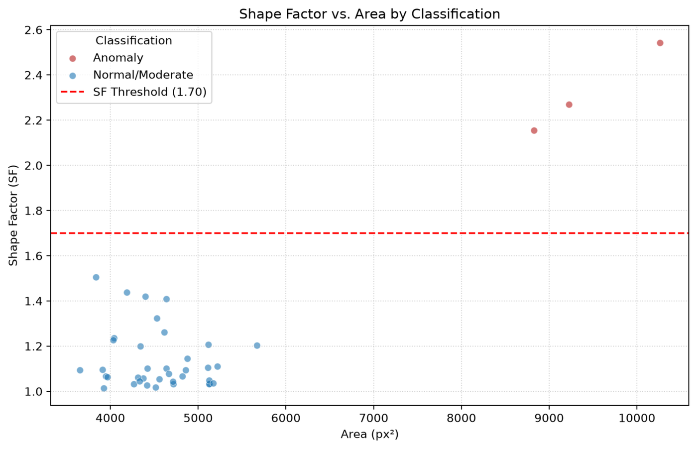

# 🔬 Erythrocyte Shape Analyzer

**Quantitative, image-based analysis of red blood cell morphology — classical computer vision (OpenCV) wrapped in an interactive Streamlit app.**

**Live demo:** <a href="https://erythrocyte-shape-analyzer.streamlit.app" target="_blank">erythrocyte-shape-analyzer.streamlit.app</a> · <a href="https://github.com/slastrzelec/erythrocyte-shape-analyzer" target="_blank">GitHub Repository</a>

*Green = normal, yellow = moderately elongated, red = highly elongated, magenta = anomaly — each cell is classified against a user-defined Shape Factor threshold.*

## Why this project

This was my first serious portfolio project, and it grew directly out of academic research: an investigation into the acute effects of functionalized carbon nanotubes (MWCNTs-Ni) on red blood cell function, where shape stability under toxic exposure is a key parameter. Rather than leaving the measurement pipeline as a one-off analysis script, I rebuilt it as a standalone, reusable tool — usable on any microscope image, not just the original research dataset.

## What it does

The app automatically detects erythrocytes in a microscope image and measures their shape using contour detection and ellipse fitting. For every detected cell it computes:

* **Shape Factor** (major axis / minor axis) — a quantitative measure of elongation
* Ellipticity, area, and perimeter, with optional pixel → micrometer calibration
* An anomaly flag against a user-configurable Shape Factor threshold

Results are exportable as CSV or Excel, and the app also serves the original research publication as a downloadable PDF with a highlighted abstract.

## Methodology

1. Convert the image to grayscale and binarize it with **Otsu's method** (automatic threshold selection, robust to uneven illumination).
2. Detect external contours and filter out anything below a configurable minimum axis size (removes noise/debris).
3. Fit an ellipse to each remaining contour (`cv2.fitEllipse`) and compute Shape Factor = major axis / minor axis.
4. Classify each cell as normal or anomalous against the threshold, and compute area/perimeter/ellipticity alongside it.

*Shape Factor vs. Area — anomalies (red) separate cleanly from the normal population.*

*Shape Factor distribution across the analyzed sample.*

## Limitation, stated plainly

Shape Factor is an elongation index. A perfectly spherical cell and a normal, healthy biconcave cell both yield Shape Factor ≈ 1, so this specific metric does not distinguish spherocytosis-type anomalies — it's built to detect elongation/elliptocytosis-type shape change, not roundness. This is a research/demonstration tool, **not a medical diagnostic device**.

## Tech stack

Python · Streamlit · OpenCV · NumPy · Pandas · Matplotlib · openpyxl

**Related:** for a contrasting computer-vision approach on the same broad problem (detecting and characterizing objects in images) — a modern deep-learning object detector plus multi-object tracking, instead of classical contour/ellipse fitting — see the [People Counter](../people-counter-yolox/index.md) project.

## Research context

The methodology is based on a study investigating multi-walled carbon nanotubes with attached Ni²⁺ ions (MWCNTs-Ni) and their acute effects on red blood cell function. The low concentration tested didn't change red blood cell size or shape, but it did affect haemoglobin's states and its ability to reversibly bind oxygen — MWCNTs-Ni-treated cells showed an increased affinity for O₂, similar to red blood cells from essential hypertensive subjects, pointing to a potential risk that MWCNTs-Ni exposure could influence hypertension development. The full publication is downloadable from within the app.

## Revisiting a first project, honestly

Coming back to this after later, more production-oriented projects, the original gap versus something like the [cuneiform sign classifier](../20_cuneiform-sign-classifier/index.md) was testing and deployment discipline rather than the core CV logic itself — the repo history reflects genuine early-stage churn (duplicate repos, unpinned dependencies) that I cleaned up rather than hid. I've since closed that specific gap: the core detection/shape-factor logic (`shape_analysis.py`) is now covered by a unit test suite run against synthetic images with known ground truth, executed automatically via GitHub Actions on every push and pull request. I've kept the project in the portfolio specifically *because* it's the starting point — the clearest before/after marker for how my engineering practices have matured.

## Author's note

First serious project → recently revisited and cleaned up: fixed a real ellipse-drawing bug (minor axis wasn't perpendicular to the major axis), pinned dependencies, added a proper LICENSE, rewrote the in-app science copy for accuracy, and added a pytest unit test suite with GitHub Actions CI running on every push.
