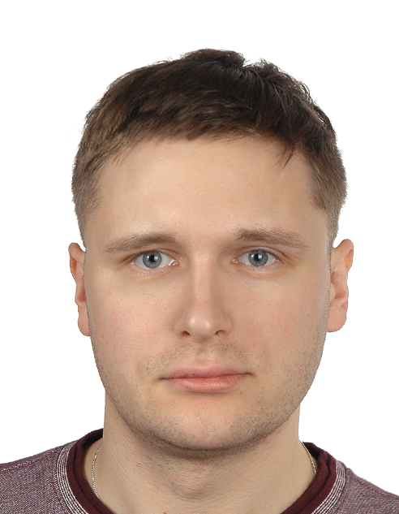

# About Me

Hello! 👋  
My name is <strong>Sławomir Strzelec</strong>. I'm an <strong>ML Engineer & Data Scientist</strong> with a research background in organic chemistry, nanotechnology, and spectroscopy — and hands-on engineering experience building production-grade AI systems, from retrieval-augmented generation pipelines to deployed REST APIs.

I combine a rigorous scientific foundation with modern software engineering practices: not just prototyping ML models, but shipping them as tested, containerized, monitored, and publicly deployed systems. My flagship project — a Carbon Nanotubes RAG System — went through six deliberate development phases: correct retrieval math, a validated REST API, structured logging, Docker, CI/CD, and live deployment. It's the clearest demonstration of how I work.

---

## What I Focus On

- Retrieval-Augmented Generation (RAG) and agentic AI systems
- Building and deploying REST APIs (FastAPI) around ML/AI pipelines
- LLM integration, prompt engineering, and AI evaluation (RAGAs)
- Computer Vision and image-based analysis
- Data processing, analysis, and modeling in Python
- Scalable data engineering and analytics pipelines
- Scientific computing and analytical reasoning

---

## 🚀 Featured Project

**Carbon Nanotubes RAG System — Production RAG**

A Streamlit prototype rebuilt into a full production system: hybrid dense+BM25 retrieval, a validated REST API, 21 automated tests (CI via GitHub Actions), Docker containers, and a live public deployment.

- **Faithfulness ≈ 0.80–0.82** (RAGAs evaluation, 14-question domain set)
- **21/21 tests passing**, enforced automatically on every push
- 🔌 <a href="https://rag-raman-api.onrender.com/docs" target="_blank">Live REST API</a> · 💻 <a href="https://carbon-nanotubes-rag.streamlit.app/" target="_blank">Live Demo</a> · 📦 <a href="https://github.com/slastrzelec/13_RAG_raman_carbon_nanotubes" target="_blank">Repository</a>

---

## Skills

### 🤖 AI & Machine Learning
- **LLM & Generative AI:** RAG, LangChain, LangGraph, prompt engineering, OpenAI API, agentic AI systems
- **AI Evaluation:** RAGAs (faithfulness, answer quality)
- **Vector Search:** FAISS, embeddings, hybrid (dense + BM25) retrieval
- **Classical ML:** scikit-learn, PyCaret, regression, classification, model evaluation
- **Deep Learning:** PyTorch
- **Computer Vision:** OpenCV, CNN-based models

### 🧑‍💻 Backend, APIs & Engineering
- **Python**, FastAPI, REST API design
- SQL, PostgreSQL
- **Docker** & docker-compose (multi-container systems, production deployment)
- **CI/CD:** GitHub Actions, automated testing (pytest)
- Structured logging & observability
- Git, GitHub
- PySpark (distributed data processing)
- Linux (CLI, environment management)

### 📊 Data Analysis & Visualization
- Exploratory Data Analysis (EDA)
- Descriptive and inferential statistics
- Data visualization and storytelling

### 🧪 Chemistry, Materials Science & Scientific Computing
- Organic synthesis and reaction optimization
- Nanotechnology of carbon structures (CNTs)
- Spectroscopy: NMR, Raman, UV–Vis
- **Chemoinformatics** (RDKit, molecular descriptors)
- Scientific literature research (SciFinder, Reaxys)

### 🧠 Soft Skills
- Grant writing & stakeholder communication
- Analytical thinking
- Teaching and mentoring
- Science communication
- Time management and teamwork

---

## My Background

### 🎓 Education

- **PhD (in progress)** – AGH University of Krakow
  Interdisciplinary Environmental PhD Studies (physics, chemistry, biophysics, nanotechnology)

- **MSc in Chemistry** – Jagiellonian University
  Modern organic synthesis & physicochemistry

- **BSc in Chemistry** – Jagiellonian University
  Synthesis and catalytic studies of chiral half-salen complexes

---

### 🔬 Scientific & Industry Experience

- **Data Engineer – HSBC (2026)**
  ETL/ELT pipelines, BigQuery, Looker Studio dashboards

- **Scientist II – Selvita (2024–2025)**
  Data analysis and experimental work in early-stage drug discovery; compound design, synthesis, and characterization

- **Internship – University of Turin (2023)**
  Organic synthesis and reaction mechanism studies

- **UNISON Project (2018–2019)**
  Authored and defended a national R&D funding application before an NCBR expert panel — application approved

- **UNISON Internship – Chemical-Resistant Coatings (2016)**

- **Coordination Chemistry Group – Jagiellonian University (2010)**
  Research on vanadium-based metallopharmaceuticals

---

### 🧪 Scientific Interests

Organic chemistry, nanotechnology, spectroscopy, machine learning in science, quantum physics, photovoltaics, drug discovery, targeted cancer therapies, energy storage.

---

### 📚 Publications & Awards

- **Scientific publication (2025):**
  *"Study of the Influence of Multi-Walled Carbon Nanotubes Functionalised with Nickel Ions on the Functioning of Red Blood Cells"* — Acta Physica Polonica A

- Rector's 1st-degree award for pioneering work in micro and nanotechnologies in biophysics
- Winner of a Jagiellonian University chemistry competition

---

## My Projects

My projects reflect both my scientific background and my engineering practice: production-grade RAG and agentic AI systems, computer vision for biomedical imaging, machine learning models for chemical property prediction, and end-to-end ML applications with full deployment — not just notebooks, but tested, documented, and shipped systems.

<a href="../" target="_blank">→ See all projects</a>

---

## Contact

- 📧 E-mail: <strong><a href="mailto:sla.strzelec@gmail.com" target="_blank">sla.strzelec@gmail.com</a></strong> 
- 💼 <a href="https://www.linkedin.com/in/s%C5%82awomir-strzelec/" target="_blank">LinkedIn</a> 
- 🐙 <a href="https://github.com/slastrzelec" target="_blank">GitHub</a> 
- 📝 <a href="https://t.me/naukowy_tg" target="_blank">Science blog</a>

---

I'm open to new challenges, collaborations, and opportunities in <strong>AI/ML engineering</strong>, <strong>agentic AI</strong>, and <strong>data science</strong>. 🚀

