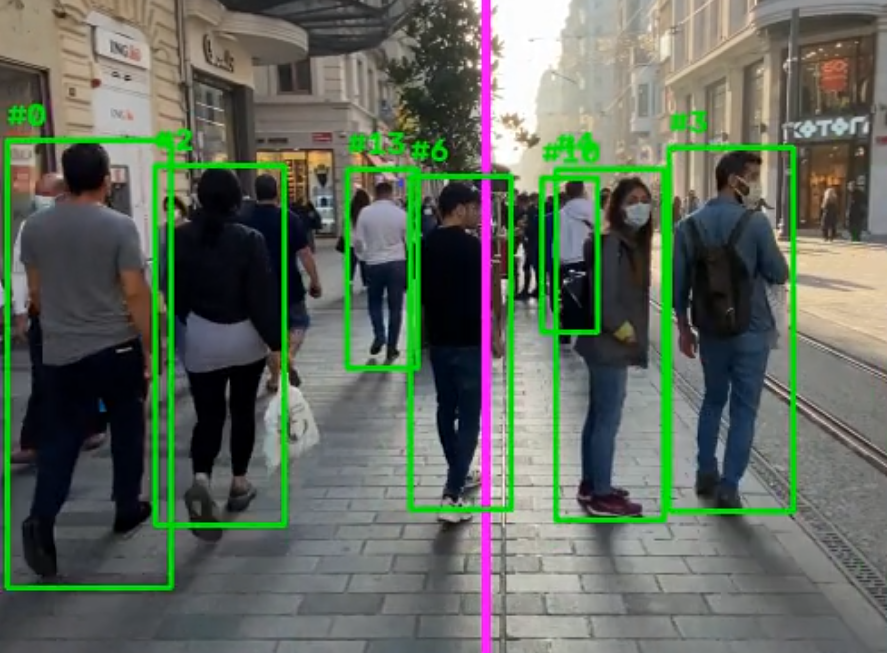
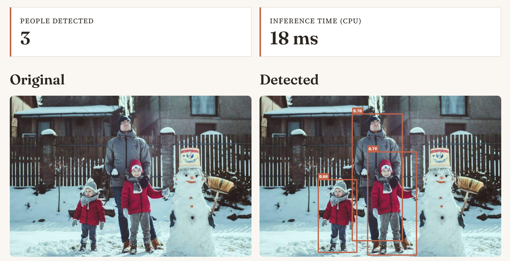

# 🚶 People Counter

**Local, CPU-only person detection and directional counting — deep-learning object detection plus multi-object tracking, wrapped in an interactive Streamlit app.**

**Live demo:** <a href="https://people-counter-yolox.streamlit.app" target="_blank">people-counter-yolox.streamlit.app</a> · <a href="https://github.com/slastrzelec/people-counter-yolox" target="_blank">GitHub Repository</a>

*Video mode — each tracked person keeps a stable ID across frames; the magenta line is a configurable counting gate (IN / OUT / NET).*

*Image mode — one-shot detection with per-box confidence scores.*

## Why this project

The portfolio previously had a "Person Counter" that was actually a Haar-Cascade **face** counter mislabeled as a person counter — it couldn't count anyone facing away from the camera, and wasn't a real detector at all. I rebuilt it from scratch as an actual person detector (YOLOX-nano, deep learning) with multi-object tracking, instead of quietly patching the old one.

Together with the [Erythrocyte Shape Analyzer](../erythrocyte-shape-analyzer/index.md), this shows two different ends of my computer vision work: classical image processing there (Otsu thresholding, contour detection, ellipse fitting), versus a modern deep-learning object detector plus a multi-object tracker here. It's also a useful contrast with the [Cuneiform Sign Classifier](../20_cuneiform-sign-classifier/index.md): that project classifies an already-cropped image, while this one has to first find and localize every person in the frame before anything else can happen.

## What it does

- **Image mode** — upload a photo, get back per-person bounding boxes with confidence scores and a total count.
- **Video mode** — upload a clip, draw a counting line anywhere in the frame, and get IN/OUT/NET counts of people crossing it, with each tracked person keeping a stable ID across frames.

A bundled sample image and video let a visitor try both modes without needing their own file.

## How it works

- **Detection:** [YOLOX-nano](https://github.com/Megvii-BaseDetection/YOLOX) (COCO-pretrained, ONNX export), run locally via ONNX Runtime on CPU. Only the "person" class is kept.
- **Tracking (video mode):** [`trackers`](https://github.com/roboflow/trackers)'s `ByteTrackTracker`, associating detections frame-to-frame by IoU.
- **Line-crossing counting:** a small, pure-Python module that watches which side of a user-drawn line each tracked person's centroid is on, and counts a crossing whenever that side flips — independent of any CV/ML code, unit-tested with synthetic positions, no video or model weights required.

## Measured accuracy

Evaluated against a real labeled sample (62 people-containing images from the public *coco128* dataset), matching detections to ground-truth boxes at IoU ≥ 0.5 — numbers are regenerated from scratch by `evaluate.py`, not estimated:

| Metric | Value |
|---|---|
| Precision | 0.825 |
| Recall | 0.520 |
| F1 | 0.638 |
| CPU inference speed | ~95 FPS (10.5 ms/image) |

## Limitations, stated plainly

- **Recall is the honest weak point.** YOLOX-*nano* is the smallest model in its family (built for speed over accuracy) and struggles most on dense crowd scenes with many small, overlapping people. A larger YOLOX variant would trade some CPU speed for materially better recall.
- **The counting line only works if it's oriented against the actual direction of motion in the video.** A camera looking *across* a path (people moving left/right) needs a vertical line; a camera looking *down* a corridor (people moving toward/away from camera) needs a horizontal one. There's no universally-correct default — this is why the line is configurable with sliders rather than fixed.
- Free-tier CPU-only hosting means very long or very high-resolution video uploads are capped (frames are downscaled before processing, and there's a hard length limit) to avoid exhausting the host's memory.

## Data security & privacy

All inference runs locally — no image or video is ever sent to a third-party API. Uploaded video is written to a private temp file only because OpenCV needs a real file path to read it, and that file is deleted immediately after processing, even if something goes wrong. Nothing uploaded is logged, stored, or kept between requests.

## Tech stack

Python · Streamlit · ONNX Runtime · OpenCV · `trackers` (ByteTrack) · `supervision` · imageio-ffmpeg

## License

Code is MIT-licensed. The bundled YOLOX-nano weights are Apache License 2.0 ([Megvii-BaseDetection/YOLOX](https://github.com/Megvii-BaseDetection/YOLOX)), used unmodified for inference only — chosen specifically over Apache/AGPL alternatives like Ultralytics YOLOv8 to keep the whole repo under a permissive, MIT-compatible license even when deployed as a publicly network-accessible app.
