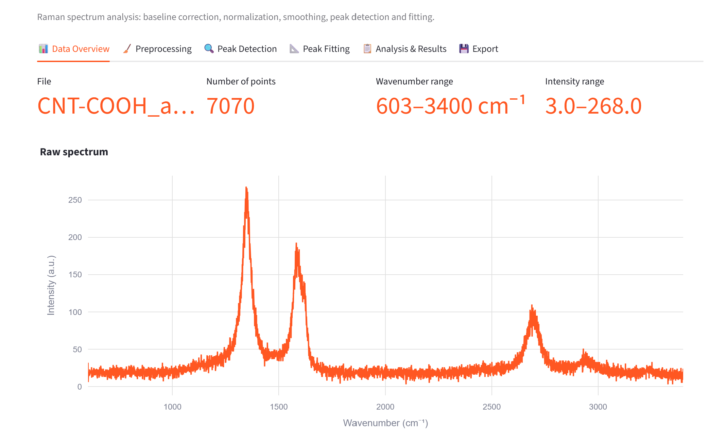
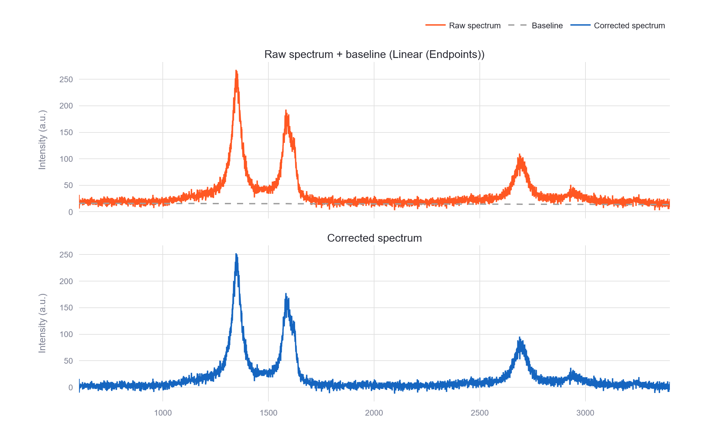
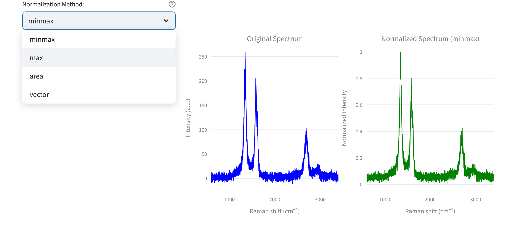
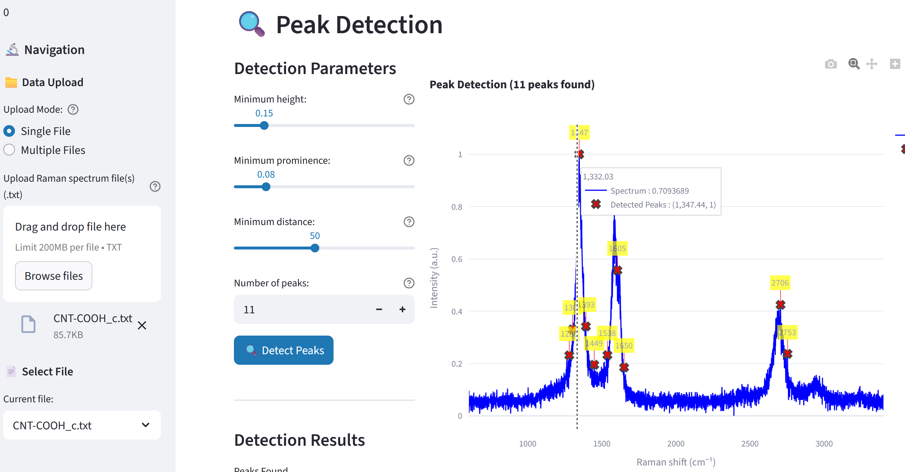

# 🔬 Raman Spectroscopy Analysis Tool

🚀 **Live Demo:** <a href="https://raman-spectroscopy-analyzer.streamlit.app/" target="_blank">raman-spectroscopy-analyzer.streamlit.app</a>

## ✨ Overview

The **Raman Spectroscopy Analysis Tool** is a comprehensive web application built with Streamlit and scientific Python libraries (Pandas, NumPy, SciPy), designed for chemists, materials scientists, and engineers to quickly and accurately process, analyze, and characterize Raman spectroscopy data, particularly focusing on **carbonaceous materials** (e.g., graphene, carbon nanotubes).

It streamlines the entire workflow from raw data import to quantitative material property extraction, eliminating the need for complex desktop software.

📈 Screenshots from the application:

#### 📊 Data Overview
The **"Data Overview"** tab is the analysis starting point. It displays **metadata** for the loaded file (e.g., CNT-COOH_a.txt), including the **number of data points** (7070), the **Wavenumber Range** (603–3400 cm⁻¹), and the intensity range, alongside a plot of the raw spectrum.

#### 🧹 Baseline Correction
The **"Preprocessing"** tab shows the raw spectrum with the fitted baseline overlaid (here, the **Linear (Endpoints)** method), and the resulting baseline-corrected spectrum below it — the three characteristic carbon-nanotube bands (D, G, 2D) are clearly resolved once the fluorescence background is removed.

#### 📈 Spectrum Normalization Comparison
The same tab lets you apply a normalization method afterwards. The screenshot shows a comparison of the original spectrum (left, blue) with the normalized spectrum (right, green) using the **Min-Max** method, which scales intensities to the range [0, 1] for cross-sample comparison.

#### 🔍 Peak Detection Visualization
The **"Peak Detection"** tab displays the results of automatic peak identification within a Raman spectrum (example for CNT-COOH_c.txt). The overlaid interactive Plotly chart visualizes 11 detected peaks (marked with a red 'X'), based on defined parameters such as Minimum height (0.15) and Prominence (0.08).

## 🛠️ Key Features and Workflow

The application implements a full-featured spectroscopy workflow across several tabs:

* **Data Handling:** Supports easy upload of single or multiple `.txt` files with Wavenumber and Intensity columns. Includes data **validation** and metadata extraction.
* **Preprocessing:** Essential steps to prepare spectra for analysis:
    * **Baseline Correction:** Algorithms including **Linear (Endpoints)** and **Asymmetric Least Squares (ALS)** to remove fluorescence background. 
    * **Normalization:** Methods like Min-Max, Max-Intensity, Area, and Vector (L2) normalization for comparison.
    * **Smoothing:** Optional Savitzky-Golay filtering to reduce noise.
* **Peak Analysis:** Automated detection and categorization of Raman bands (**D, G, 2D bands** for carbon materials). Calculates fundamental peak statistics.
* **Quantitative Fitting & Deconvolution:** Advanced fitting using **Lorentzian** or **Gaussian** models for precise deconvolution of overlapping bands (e.g., D and G bands). This allows calculation of critical ratios.
* **Material Characterization:** Calculates key material parameters based on fitting results, such as:
    * The **$I_D/I_G$ ratio**, crucial for determining defect density/crystallinity, plus an estimated crystallite size (La) via the Tuinstra-Koenig relation — parameterized by the instrument's actual laser excitation wavelength (458-785 nm) rather than a single hardcoded constant.
    * The **$I_{2D}/I_G$ ratio**, critical for characterizing the number of graphene layers.
* **Visualization & Export:** Interactive plots (Plotly) at every stage of the pipeline and the ability to export final results.

## 💻 Technical Stack

| Category | Technology | Purpose |
| :--- | :--- | :--- |
| **Frontend/App** | **Streamlit** | Rapid web application development and interactive UI/UX. |
| **Data Processing** | **Python (Pandas, NumPy)** | Core data manipulation and scientific computing. |
| **Signal Processing** | **SciPy** | Implementation of advanced algorithms (Savitzky-Golay, Peak Detection, ALS). |
| **Peak Fitting** | **SciPy** (`curve_fit`) | Bounded non-linear least squares for peak deconvolution, with parameter uncertainties from the fit covariance matrix. |
| **Visualization** | **Plotly** / **Matplotlib** | Generating responsive, interactive data visualizations. |

## 🧪 Testing

Core logic (data loading/validation, preprocessing, peak detection, peak fitting,
export, batch processing) is covered by a 65-test pytest suite, run automatically
on every push via GitHub Actions.

## 🌟 Contributions and Impact

This project showcases expertise in:

* **Scientific Software Development:** Creating reliable, user-friendly tools for specialized scientific domains.
* **Signal and Data Processing:** Applying statistical methods to complex spectral data.
* **Chemical/Materials Informatics:** Direct application of computational tools to characterize physical properties from spectroscopic data.

## 🔗 Project Links

* <a href="https://raman-spectroscopy-analyzer.streamlit.app/" target="_blank">Live Demo</a>
* <a href="https://github.com/slastrzelec/raman-spectroscopy-analyzer" target="_blank">GitHub Repository</a>

## 🧬 Related Projects

Part of the same carbon-nanotube work as the
[Carbon Nanotube Visualizer](../carbon-nanotube-visualizer/index.md) (structure and
electronic-property modeling) and the
[Carbon Nanotubes RAG System](../13_RAG_raman/index.md) (literature Q&A over the
underlying research papers).

