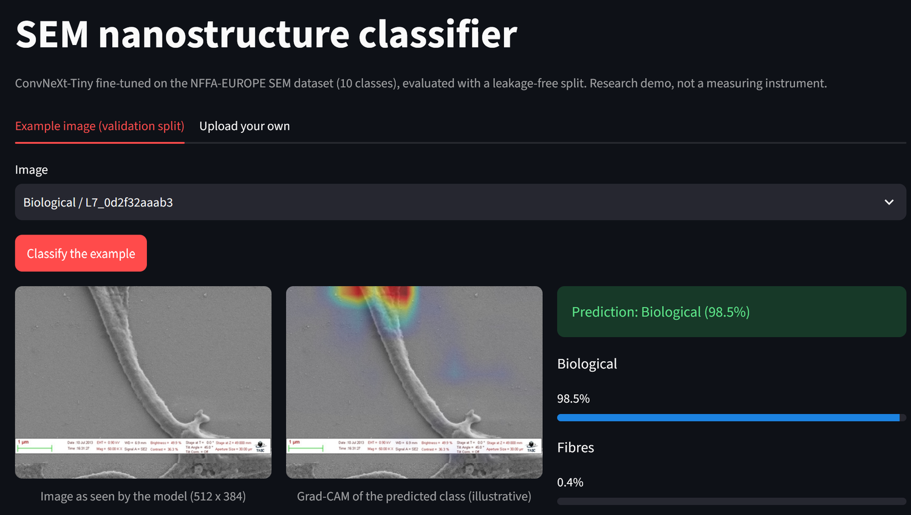

# 🔍 SEM Nanostructure Classifier

**A classifier for scanning-electron-microscopy (SEM) images of nanostructures, built to answer one question: how much of the reported accuracy is real, once near-duplicate leakage and instrument shortcuts are controlled for?**

**Live demo:** <a href="https://sem-nanostructure-classifier.streamlit.app/" target="_blank">sem-nanostructure-classifier.streamlit.app</a> · <a href="https://github.com/slastrzelec/sem-nanostructure-classifier" target="_blank">GitHub Repository</a> · <a href="https://huggingface.co/slastrzelec/sem-nanostructure-classifier-convnext-tiny" target="_blank">Weights and model card (Hugging Face)</a>

*The Streamlit demo: pick a validation example or upload an image, see the top-3 classes with calibrated probability, an "uncertain" flag below a threshold chosen on validation, and an illustrative Grad-CAM.*

## Why this project

Image classifiers on microscopy data often report very high accuracy that does not survive a closer look: the same sample photographed several times lands in both train and test, and the instrument's information bar can carry the label. Instead of chasing a leaderboard score, this project fixes the evaluation rules in a written specification **before** any code, and then reports what is and is not established — including the negative and inconclusive results.

## Results at a glance

Test split, group-aware (near-duplicate clusters kept together), mean of 3 seeds:

| Model | Macro-F1 (95% CI over clusters) | Accuracy | ECE raw → calibrated |
|---|---|---|---|
| ConvNeXt-Tiny | 0.956 [0.939, 0.966] | 0.972 | 0.024 → 0.006 |
| ResNet-50 | 0.944 [0.924, 0.957] | 0.965 | 0.024 → 0.009 |

Dataset: NFFA-EUROPE "100% SEM Dataset", 10 classes, 20,837 images after removing 332 exact duplicates (CC BY). ConvNeXt-Tiny is ahead of ResNet-50 in every comparison, but this was not tested formally.

## What the evaluation showed

- **Leakage.** A random split gives macro-F1 0.968 (ConvNeXt-Tiny) against 0.956 on the group-aware split, a gap of 1.3 pp with the same sign in both backbones; the intervals include or touch zero, so the gap is **not established**. In the random split 23.4% of test images have a near-duplicate "cluster-mate" in train; these are classified at 99.6-99.9% accuracy, the rest at 96.4-97.2%.
- **Info bar.** Removing the bottom 18.75% of every image (where the bar sits) costs 1.4 pp macro-F1 on test (interval +0.4 to +2.3), removing the same amount from the top costs nothing. The validation split shows no drop. Reading: no evidence of a shortcut that carries the classification; a contribution of about 1-1.5 pp in the small classes cannot be excluded.
- **Confidence.** Temperature scaling (T = 3.3) cuts the expected calibration error from 0.024 to 0.006. Abstaining below a threshold chosen on validation keeps 94% of test images at 99.2% accuracy (overall 97.2%) and catches about 71% of the errors, but it abstains mostly on rare classes (44% of Porous_Sponge, 37% of Films_Coated_Surface).

## Methodology

- **Specification first.** `SPEC.md` fixes the data-security and leakage rules, the split procedure and the test protocol before the code exists; every change is logged in it with a date.
- **Near-duplicate-aware splits.** Groups are connected components of cosine similarity ≥ 0.94 between frozen ResNet-50 features; whole clusters go to one of train/validation/test (70/15/15). A test asserts that no cluster crosses splits; thresholds 0.90 and 0.98 serve as a sensitivity check.
- **Fixed configuration, no tuning.** One training recipe for every run, 3 seeds per model, epoch chosen on validation macro-F1.
- **Test evaluated once.** Each checkpoint touches the test split exactly once, after the configuration was frozen; nothing was changed after seeing test results. The calibration and abstention analysis is post-hoc on stored test logits, with all parameters fitted on validation only.
- **A bug caught before testing.** The first group-aware split put almost all large clusters into validation and test. It was noticed from the validation loss, the split was fixed and all group-aware runs were repeated; the details are in the spec.

## Engineering

- **Deployment:** Streamlit Community Cloud; the weights live on the Hugging Face Hub and are downloaded on the first start and verified against a recorded sha256 (a mismatch means no model is loaded). Uploads are processed in memory only, nothing is stored or logged.
- **Tests and CI:** pytest (splits, metrics, calibration, inference, download integrity), ruff, and a CI guard that fails if weights, archives, keys or files over 5 MB are ever committed.
- **Tech stack:** PyTorch, torchvision (ConvNeXt-Tiny, ResNet-50), Grad-CAM, Streamlit, GitHub Actions, Hugging Face Hub.

## Limitations

- One lab, one dataset, no external test set; the group definition (embedding similarity) is a proxy for "same sample".
- Confidence intervals describe the test sample, not the variation between trainings; with 3 seeds, differences of about 1 pp are at the noise level of single runs.
- Small classes have 22-46 test images, so per-class numbers move by several points with one image.
- The demo has no out-of-distribution detector: any image, including a photograph, gets one of the 10 SEM classes.
- Two ablations from the original plan (class weights, stronger augmentation) were **not run**.

**Related:** the same discipline of group-aware splits and honest error analysis, applied to a different domain, is in the [Cuneiform Sign Classifier](../20_cuneiform-sign-classifier/index.md) (split by tablet, not by image). A smaller transfer-learning classifier with an honest baseline comparison is the [Emotion Recognition](../emotion-recognition-cv/index.md) project. The nanostructures behind the SEM classes connect to the [Carbon Nanotube Visualizer](../carbon-nanotube-visualizer/index.md).
